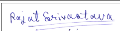

*DS\&AI Lab Project \[Term May 2026\]*

**Intelligent Medical Report Analysis System**

 

MILESTONE-1: Problem Definition & Literature Review 

 

![][image1]  

Indian Institute of Technology Madras 

**GROUP: 2**

| Name | Email | GitHub Usernames | Signature |
| :---: | ----- | :---: | ----- |
| Shivendra Patel | 21f2001310@ds.study.iitm.ac.in | shivendra1717 |  |
| Rajat Srivastava | 22f3003195@ds.study.iitm.ac.in | 22f3003195 | ![][image3] |
| Samta Ranka | 23f1001316@ds.study.iitm.ac.in | 23f1001316 | ![][image4] |
| Ritwik Trivedi  | 22f1000120@ds.study.iitm.ac.in | ritwiktrivedi | ![][image5] |
| Bryan David Robinson | 22f3002277@ds.study.iitm.ac.in | brilo1819 | ![][image6] |

Contents

[**1\. Project Objectives & Problem Definition	3**](#heading=)

[1.1 The Problem Statement	3](#1.1-the-problem-statement)

[1.2 Core Project Objectives	3](#1.2-core-project-objectives)

[1.3 The Dual-Value Architecture	4](#1.3-the-dual-value-architecture)

[1.4 Key Stakeholders	4](#1.4-key-stakeholders)

[Primary Stakeholders	4](#primary-stakeholders)

[Secondary Stakeholders	4](#secondary-stakeholders)

[System Stakeholders	4](#system-stakeholders)

[1.4 Project Scope & Boundaries	5](#1.4-project-scope-&-boundaries)

[**2\. Review of Existing Solutions, Baselines, and Benchmarks	6**](#2.-review-of-existing-solutions,-baselines,-and-benchmarks)

[2.1 Existing Market Solutions & Gaps	6](#2.1-existing-market-solutions-&-gaps)

[Medical-Specific AI and Clinical Decision Support Systems	6](#medical-specific-ai-and-clinical-decision-support-systems)

[2.2 Relevant Data Sources & Material Findings	8](#2.2-relevant-data-sources-&-material-findings)

[**3\. Identified Gaps & System Opportunities	8**](#3.-identified-gaps-&-system-opportunities)

[**4\. Comparison of Approaches & System Strategy	9**](#4.-comparison-of-approaches-&-system-strategy)

[4.1 Handling Layout Variations (Robustness)	9](#4.1-handling-layout-variations-\(robustness\))

[4.2 Key System Differences	10](#4.2-key-system-differences)

[4.3 Baseline Models and Rationale	10](#4.3-baseline-models-and-rationale)

[Why these are used as baselines	10](#why-these-are-used-as-baselines)

[Role in this project	11](#role-in-this-project)

[**5\. Baseline Metrics & Evaluation Plan	11**](#5.-baseline-metrics-&-evaluation-plan)

[5.1 Performance Benchmarks	11](#5.1-performance-benchmarks)

[5.2 Literature Benchmarks	12](#5.2-literature-benchmarks)

[**6\. Technical Feasibility & Resource Considerations	12**](#6.-technical-feasibility-&-resource-considerations)

[6.1 Training Environment	12](#6.1-training-environment)

[6.2 Deployment Flexibility	13](#6.2-deployment-flexibility)

[**7\. References	13**](#7.-references)

# 1\. Project Objectives & Problem Definition

## 1.1 The Problem Statement {#1.1-the-problem-statement}

Medical reports are notoriously difficult for ordinary people to read because they are packed with heavy clinical jargon like triglycerides or creatinine. This language barrier causes a lot of anxiety for patients and makes it tough to spot critical health metrics, and often leads patients to either ignore important results or excessively worry about borderline values. Furthermore, generic AI tools often provide broad, free-text summaries that lack clean formatting, require constant follow-up questions, and may generate inaccurate or unsupported medical information (hallucinations), making them unsuitable as standalone clinical interpretation tools.

## 1.2 Core Project Objectives {#1.2-core-project-objectives}

The objective of this project is to develop an intelligent assistant that processes uploaded medical reports (PDF or image) to bridge the communication gap between complex clinical documentation and individuals who need to understand it. The project aims to achieve the following measurable objectives:

1. **Accurately extract key medical information** by identifying laboratory values, diagnoses, and clinical measurements from uploaded reports with an **F1-score of at least 0.85** on the evaluation dataset.  
2. **Identify abnormal laboratory findings** by comparing extracted laboratory values against predefined clinical reference ranges and automatically flagging results that fall outside the normal limits.  
3. **Generate simplified medical explanations** by translating complex medical terminology into plain English with a readability level equivalent to **Grade 8 or below**, making the information accessible to non-medical users.  
4. **Produce a structured dual-output summary** for every uploaded report, consisting of:  
   * a visual dashboard highlighting key health metrics and abnormal findings, and  
   * a concise plain-language explanation of the report.  
5. **Ensure patient data privacy** by executing report processing locally on a standard laptop (minimum **8 GB RAM**) without transmitting medical data to external cloud servers.

   

   

   

## 1.3 The Dual-Value Architecture {#1.3-the-dual-value-architecture}

This project explores a dual-purpose value proposition serving two groups simultaneously:

1. **Ordinary Patients:** Providing them with clear, direct translations of their medical results so they do not have to keep guessing or repeatedly prompting generic tools. 

2. **Healthcare Students & Trainees:** Offering a rapid, structured view of the main health highlights and metrics to help them learn to quickly review cases. 

## 1.4 Key Stakeholders {#1.4-key-stakeholders}

This project is designed with multiple stakeholder groups who interact with or benefit from the system in different ways:

### **Primary Stakeholders** {#primary-stakeholders}

* **Patients (Non-medical users):**  
   End users who upload medical reports and receive simplified explanations of laboratory results, abnormal flagging, and visual dashboards.  
* **Healthcare Students & Medical Trainees:**  
   Use the system as a learning aid to quickly interpret lab reports, understand clinical terminology, and practice reading structured medical data.

### **Secondary Stakeholders** {#secondary-stakeholders}

* **Doctors & Clinicians (Indirect Users):**  
   They do not use the system directly for diagnosis, but may benefit from patients having better pre-understanding of reports, reducing explanation burden.  
* **Developers / Researchers:**  
   Use the system architecture and results to explore lightweight clinical NLP models and extraction pipelines.

### **System Stakeholders** {#system-stakeholders}

* **Hospitals / Diagnostic Labs (Data Providers):**  
   Source of structured/unstructured medical reports used for testing and evaluation datasets.  
* **Regulatory & Ethical Oversight (Indirect):**  
  Ensures the system is used as an assistive tool and not a diagnostic replacement.

### 1.4 Project Scope & Boundaries {#1.4-project-scope-&-boundaries}

The proposed system focuses on simplifying the interpretation of laboratory-based medical reports by extracting important clinical information and presenting it in an easy-to-understand format. The project is intended as an assistive tool to improve report comprehension and is not designed to replace professional medical advice or clinical decision-making.

**Project Scope**

* Accept laboratory medical reports in PDF or image format as input.  
* Extract key clinical entities such as laboratory test names, numerical values, units, diagnoses, and reference ranges.  
* Identify abnormal laboratory values by comparing extracted results with predefined clinical reference ranges.  
* Generate plain-language explanations of medical terminology and report findings.  
* Present the extracted information through a structured dashboard along with a concise patient-friendly summary.  
* Support local execution of the inference pipeline to improve data privacy whenever feasible.

**Project Boundaries**

* The system will not provide medical diagnoses, treatment recommendations, or medication prescriptions.  
* It is intended to assist users in understanding existing medical reports and should not replace consultation with qualified healthcare professionals.  
* The project focuses on laboratory reports and does not include interpretation of medical images such as X-rays, CT scans, MRI scans, or ultrasound images.  
* Processing of handwritten prescriptions and highly unstructured medical documents is outside the scope of this project.  
* The system is designed as a proof-of-concept implementation and will be evaluated using publicly available datasets rather than deployed in real clinical environments.

# 2\. Review of Existing Solutions, Baselines, and Benchmarks {#2.-review-of-existing-solutions,-baselines,-and-benchmarks}

## 2.1 Existing Market Solutions & Gaps {#2.1-existing-market-solutions-&-gaps}

Our review of how people currently try to solve this problem highlights several key limitations in the options currently available on the market:

* **Generic AI Platforms (e.g., ChatGPT / Gemini):** While widely accessible, these general-purpose tools often provide broad, free-text summaries that fail to explicitly isolate what abnormal lab results mean for an individual. They require users to repeatedly prompt or clarify queries, and they carry a well-documented risk of hallucinating or altering factual medical numbers.  
* **Standard Hospital Formats:** While highly accurate, current electronic health records are formatted strictly for practicing professionals. They contain dense jargon (such as specific listings for *triglycerides* or *creatinine*) that create an immediate comprehension barrier for students and patients.

### **Medical-Specific AI and Clinical Decision Support Systems** {#medical-specific-ai-and-clinical-decision-support-systems}

In addition to general-purpose AI assistants, several medical-specific AI systems and clinical decision support platforms have been developed to assist healthcare professionals. These tools provide evidence-based information and specialized medical knowledge but are primarily designed for clinical use rather than helping patients understand their own medical reports.

| Solution | Strengths | Limitations |
| :---- | :---- | :---- |
| **Med-PaLM** | A medical large language model trained and evaluated for answering medical questions with high accuracy. | Not publicly available for local deployment or customization, and focuses primarily on question answering rather than structured report interpretation. |
| **Glass Health** | Assists clinicians by generating differential diagnoses and clinical reasoning support. | Designed for healthcare professionals and clinical workflows rather than patient-friendly explanations of laboratory reports. |
| **AMBOSS** | Provides comprehensive medical knowledge, clinical guidelines, and learning resources for students and practitioners. | Subscription-based platform and does not automatically analyze uploaded medical reports. |
| **UpToDate** | Widely trusted evidence-based clinical reference used by physicians worldwide. | Primarily a reference database requiring manual search and interpretation rather than automated report simplification. |
| **DynaMed** | Offers continuously updated evidence-based clinical recommendations. | Intended as a clinical reference tool and does not perform document analysis or personalized report summarization. |
| **ClinicalKey** | Extensive medical literature and textbook repository supporting clinical decision-making. | Functions mainly as a knowledge resource and lacks automated extraction and explanation of laboratory reports. |

These systems demonstrate that reliable medical knowledge resources already exist for healthcare professionals. However, they generally assume users possess clinical knowledge, require manual searching, or focus on clinical decision support instead of automatically extracting, simplifying, and explaining information from patient medical reports. This creates an opportunity for an AI-assisted system that combines automated medical report analysis with patient-friendly explanations while preserving factual accuracy.

## 2.2 Relevant Data Sources & Material Findings {#2.2-relevant-data-sources-&-material-findings}

We have identified several open-source medical datasets available on public platforms like Kaggle and Hugging Face that provide baseline materials for our training phase:

* **MTSamples:** A dataset consisting of thousands of real-world, anonymized clinical notes and medical transcriptions.  
* **PubMed Clinical Data:** Publicly available clinical abstracts and text sequences.  
* **PhysioNet:** Specialized medical and clinical data repositories.

**Experimental Note on Data:** Since this project is an experiment to see how lightweight models perform under strict resource limits, these datasets will serve as our initial foundation. We are using this milestone to test their coverage, and we will evaluate during development whether they are entirely sufficient or if further data adjustments are needed.

# 3\. Identified Gaps & System Opportunities {#3.-identified-gaps-&-system-opportunities}

Our literature review of current AI applications in healthcare revealed three critical gaps that our proposed solution aims to solve:

| Identified Gap in Existing Solutions | Our Project's Proposed Opportunity |
| :---- | :---- |
| **The Hallucination Risk:** Standard generative LLMs frequently hallucinate or alter critical numerical values when summarizing medical data, leading to dangerous inaccuracies. | **Deterministic Splitting:** We are completely separating numerical extraction from text generation. Lab values and reference ranges will be isolated by an extraction model and processed via a hard-coded script. The AI cannot invent numbers. |
| **Lack of UI Structure:** Generic tools like ChatGPT or Gemini output long, free-text paragraphs that require patients or students to keep asking follow-up questions. | **The Dual-Output Dashboard:** The system automatically formats outputs into a structural visual scorecard (vitals/flags) for quick reference, alongside a direct plain-English paragraph. |
| **Data Privacy Concerns:** Existing public AI tools require users to upload sensitive, highly personal health data to third-party online cloud servers. | **Local-First Execution:** By utilizing lightweight, optimized models, our final testing script will execute completely locally on standard 8GB RAM laptops, processing text purely in-memory due to which reports remain on the user's device and are processed without requiring cloud-based storage. . |

# 4. Comparison of Approaches & System Strategy {#4.-comparison-of-approaches-&-system-strategy}

To address the specific limitations of existing solutions without depending on a single, rigid document format, we plan to explore a flexible two-stage pipeline:

**\[Uploaded Document\] ➔ \[Stage 1: Raw Text Extraction (OCR/PDF)\] ➔ \[Stage 2: Medical NLP Model (ClinicalBERT)\] ➔ \[Deterministic Verification Rules\] ➔ \[Final Simplified Output**

## 4.1 Handling Layout Variations (Robustness) {#4.1-handling-layout-variations-(robustness)}

A common failure of basic extraction tools is relying on fixed document templates. Our proposed approach resolves this by focusing on text content rather than document position:

* **Stage 1 (Text Scraping):** We extract raw text from PDFs or scanned images using standard text extraction and OCR (Optical Character Recognition).  
* **Stage 2 (Contextual NLP):** We will utilize base transformer models such as **ClinicalBERT** or **BioBERT** to identify entities like test names, values, units, and diagnoses based entirely on context. Whether a report reads `Hb: 10.2 g/dL`, `Hemoglobin = 10.2`, or `Haemoglobin: 10.2`, the model learns to map these variations to the exact same medical concept.

  The extraction model will also generate a confidence score for each identified entity. If confidence falls below a predefined threshold, the system will notify the user that the report could not be interpreted reliably instead of generating potentially inaccurate explanations. 

## 4.2 Key System Differences  {#4.2-key-system-differences}

| Feature | Existing General AI Solutions | Our Proposed Experimental Approach |
| :---- | :---- | :---- |
| **Data Grounding** | Broad, generalized internet data. | Training and focus restricted specifically to medical datasets (MTSamples, PubMed). |
| **Numerical Accuracy** | High risk of hallucinating numbers or ranges. | **Deterministic Splitting:** Rule-based logic is applied *only after* extraction to match values against reference ranges. The AI cannot invent lab numbers. |
| **Layout Dependency** | Often requires rigid text pasting or templates. | Model-based extraction reads semantic content, making it robust across different hospital layouts. |

## 4.3 Baseline Models and Rationale {#4.3-baseline-models-and-rationale}

Currently, transformer-based biomedical language models such as **ClinicalBERT** and **BioBERT** are used as baseline models for the medical entity extraction stage of the system.

### **Why these are used as baselines** {#why-these-are-used-as-baselines}

* **Domain-specific training:**  
   Both models are pre-trained on biomedical corpora (PubMed, clinical notes), making them more suitable than general NLP models for medical entity recognition.  
* **Proven benchmark performance:**  
   They are widely used in research as standard baselines for:  
  * Named Entity Recognition (NER)  
  * Medical concept extraction  
  * Clinical text classification  
* **Fair comparison standard:**  
   Using these models allows us to compare our pipeline against established biomedical NLP systems rather than generic language models.

### **Role in this project** {#role-in-this-project}

In this system:

* **BioBERT / ClinicalBERT** → used for **entity detection layer (lab tests, values, diagnoses)**  
* **Rule-based module** → handles **numerical validation & abnormality detection**  
* **LLM / simplification layer** → converts structured output into patient-friendly explanation

# 5\. Baseline Metrics & Evaluation Plan {#5.-baseline-metrics-&-evaluation-plan}

## 5.1 Performance Benchmarks {#5.1-performance-benchmarks}

As this project is an experimental implementation using lightweight transformer models under computational constraints, the system will be evaluated using established Natural Language Processing (NLP) metrics. The evaluation is divided into two main components: **medical information extraction** and **medical text simplification**.

#### **1\. Information Extraction Performance**

The extraction module will be evaluated based on its ability to correctly identify laboratory test names, numerical values, diagnoses, and other clinical entities from uploaded medical reports. The following metrics will be used:

* **Accuracy:** Measures the overall percentage of correctly extracted entities compared with the ground truth annotations.  
* **Precision:** Measures the proportion of extracted entities that are correct, indicating how many of the model's predictions are accurate.  
* **Recall:** Measures the proportion of relevant clinical entities that are successfully extracted from the report, indicating the model's completeness.  
* **F1-Score:** Calculates the harmonic mean of precision and recall, providing a balanced measure of extraction performance, particularly when the dataset contains imbalanced entity types.

#### **2\. Medical Text Simplification Performance**

The explanation module will be evaluated by comparing the generated plain-English summaries with verified reference summaries prepared for the evaluation dataset. The following metrics will be used:

* **BLEU (Bilingual Evaluation Understudy):** Measures the similarity between the generated explanation and the reference explanation based on matching word sequences.  
* **ROUGE (Recall-Oriented Understudy for Gisting Evaluation):** Measures how well the generated explanation captures the important information contained in the reference summary.  
* **Readability Metrics:** The clarity and accessibility of the generated explanations will be assessed using standard readability measures such as the **Flesch Reading Ease** score and the **Flesch-Kincaid Grade Level**. The target is to produce explanations that can be understood by readers with approximately a Grade 8 reading level or below.

Together, these metrics provide a comprehensive evaluation of the proposed system by measuring **extraction accuracy**, **information completeness**, **summary quality**, and **overall readability**, ensuring that the generated outputs are both medically informative and easy for non-expert users to understand.

### 5.2 Literature Benchmarks {#5.2-literature-benchmarks}

To interpret the performance of the proposed system, our evaluation will be compared with commonly reported results from biomedical NLP literature. Pretrained biomedical transformer models such as BioBERT and ClinicalBERT have demonstrated F1-scores typically ranging from **85% to over 90%** on biomedical named entity recognition tasks, depending on the dataset and entity types. Since this project uses lightweight models and limited computational resources, achieving an F1-score of approximately **0.85 or higher** for clinical entity extraction is considered a realistic performance target. Similarly, readability will be evaluated with the goal of producing explanations at approximately the **Grade 8 reading level**, consistent with recommendations for patient education materials.

# 6\. Technical Feasibility & Resource Considerations  {#6.-technical-feasibility-&-resource-considerations}

## 6.1 Training Environment {#6.1-training-environment}

We want to be realistic about our computing boundaries. Training or fine-tuning transformer-based models like ClinicalBERT requires significantly more resources than a standard 8GB RAM laptop can provide. Therefore, we do not plan to train models locally. We will handle our training and fine-tuning using accessible cloud infrastructure, specifically **Kaggle's T4 GPUs**. 

## 6.2 Deployment Flexibility {#6.2-deployment-flexibility}

Once the model is ready, our primary plan is to deploy only the final inference model to run locally:

* **Local Inference Path:** For end-users, the application will process only one medical report at a time. While running smaller transformer models on an 8GB RAM CPU with no dedicated GPU may be slow, the computational workload for a single document should keep response times acceptable.  
* **Alternative Server Path:** If local hardware testing proves inadequate or too slow on older laptops during development, we maintain the flexibility to host the inference script on a secure server. In this scenario, reports will be processed purely in-memory as temporary inputs and completely wiped upon closing to ensure total patient data privacy.

# 7\. References {#7.-references}

E. Alsentzer *et al.*, "Publicly Available Clinical BERT Embeddings," *arXiv preprint arXiv:1904.03323*, 2019\.

J. Lee *et al.*, "BioBERT: A Pre-trained Biomedical Language Representation Model for Biomedical Text Mining," *Bioinformatics*, vol. 36, no. 4, pp. 1234–1240, 2020\.

HL7 International, *Fast Healthcare Interoperability Resources (FHIR) Release 5*. Available: [https://hl7.org/fhir/](https://hl7.org/fhir/)

C. J. McDonald *et al.*, "LOINC, a Universal Standard for Identifying Laboratory Observations," *Clinical Chemistry*, vol. 49, no. 4, pp. 624–633, 2003\.

SNOMED International, *SNOMED CT Starter Guide*. Available: [https://www.snomed.org/](https://www.snomed.org/)

U.S. Department of Health & Human Services, *Health Insurance Portability and Accountability Act (HIPAA)*. Available: [https://www.hhs.gov/hipaa/](https://www.hhs.gov/hipaa/)

European Union, *Regulation (EU) 2016/679: General Data Protection Regulation (GDPR)*. Available: [https://gdpr-info.eu/](https://gdpr-info.eu/)

[image1]: <data:image/png;base64,iVBORw0KGgoAAAANSUhEUgAAASgAAAEoCAMAAADc2ZwrAAADAFBMVEUAAAAAAAAAADMAAGYAAJkAAMwAAP8AMwAAMzMAM2YAM5kAM8wAM/8AZgAAZjMAZmYAZpkAZswAZv8AmQAAmTMAmWYAmZkAmcwAmf8AzAAAzDMAzGYAzJkAzMwAzP8A/wAA/zMA/2YA/5kA/8wA//8zAAAzADMzAGYzAJkzAMwzAP8zMwAzMzMzM2YzM5kzM8wzM/8zZgAzZjMzZmYzZpkzZswzZv8zmQAzmTMzmWYzmZkzmcwzmf8zzAAzzDMzzGYzzJkzzMwzzP8z/wAz/zMz/2Yz/5kz/8wz//9mAABmADNmAGZmAJlmAMxmAP9mMwBmMzNmM2ZmM5lmM8xmM/9mZgBmZjNmZmZmZplmZsxmZv9mmQBmmTNmmWZmmZlmmcxmmf9mzABmzDNmzGZmzJlmzMxmzP9m/wBm/zNm/2Zm/5lm/8xm//+ZAACZADOZAGaZAJmZAMyZAP+ZMwCZMzOZM2aZM5mZM8yZM/+ZZgCZZjOZZmaZZpmZZsyZZv+ZmQCZmTOZmWaZmZmZmcyZmf+ZzACZzDOZzGaZzJmZzMyZzP+Z/wCZ/zOZ/2aZ/5mZ/8yZ///MAADMADPMAGbMAJnMAMzMAP/MMwDMMzPMM2bMM5nMM8zMM//MZgDMZjPMZmbMZpnMZszMZv/MmQDMmTPMmWbMmZnMmczMmf/MzADMzDPMzGbMzJnMzMzMzP/M/wDM/zPM/2bM/5nM/8zM////AAD/ADP/AGb/AJn/AMz/AP//MwD/MzP/M2b/M5n/M8z/M///ZgD/ZjP/Zmb/Zpn/Zsz/Zv//mQD/mTP/mWb/mZn/mcz/mf//zAD/zDP/zGb/zJn/zMz/zP///wD//zP//2b//5n//8z///8BAgMBAgMBAgMBAgMBAgMBAgMBAgMBAgMBAgMBAgMBAgMBAgMBAgMBAgMBAgMBAgMBAgMBAgMBAgMBAgMBAgMBAgMBAgMBAgMBAgMBAgMBAgMBAgMBAgMBAgMBAgMBAgMBAgMBAgMBAgMBAgMBAgMBAgMBAgPO+WcnAAAAAXRSTlMAQObYZgAAWCNJREFUeF7NvW+QHMd1J5jF6e2CQmHCBo9tj+5GoTWrzWHn8MaoUTg8iqPDuKNDmNOKg7CAQZxOzQiF5mLDNjcsrBCroT5oBH0woQvKtO+s897G6FbBtleHBq3VYC2DiMWFeKZPozhqCtaws09QF2LlI9YzxxahwyhOQlVo1Pd+L7Oqq6qr/80MKD82UZP1qrKyst57+d7Lly8t8Q8CForrYnGdDlZQLKuiCIui3KLyVcb8Q4CJ7Im3G84f9c8fPVXaOXV079RR+dC23GnLnenSzrRC+X1H5U75FC7xsze+zVDInnibYEEqIZUUiv7M4nrhPP3M9fL5LPLtASt74m2ABc1afoeYrKxsB6xmd8otwWWc6gzG/yy48W3vqJgyDni8mq34PsPb3FELRBl+YENi2yIgyrEDWxDlCDo6yg7EGPivZiu/r/A2CfMF+cun3vfwB48Wyzu7TntiItydKL81Ud4pltv07+7E3sRE2Z8ot8fBPzz9waPy5kL57RHzD2RP3A9YEDKUSpWVpF+gZFiWQVmFuhzSqTKdUsF+8AuSRf39h7eB9RbDQawU4HwX75IEim7sWCqAEA+Lobku5/5OWdDx/kus+99RC/nCOD62wmTZdfVdga0cW23gvL24DjLK3pc+3nel4f7qUef5RfJB2u68xB+fTJ614yPh5GZIfy6583xKOUp48YUZgF52X8nqPlLUqT6sglGL3j7qElHzZBdftR3ho/9AUE6NThU/G18p1NqQUfH+9dV9G/XOH92T29Olbbm9N60kjm25TUcyTeh4t2BYjOC1XZw3+OvBl68Hdkkor/bKTy4fo/M77ynFl74ZmvsfUlRvTv3vu2+mzn2iKOhLWU0bwijWtN0qXwdmCtKaeLHcAg2ttSDBqSxeoOtqkliVDo3oflFkIZ+jyd8ntf2+yKhTgRChX1Y+/VuEnkOixrKf7lhunSSWj7dXJICJ6agvJPBFc3HoC6tlaV6DdKMyFzwVwO4JBV1MlzjL+kHKU4LrT95//r5o7fehoxbMaKSSo9KDS4xza4EZrRwU6f36jGLKDuP7cWGQxNuaHKkvpae87P30732wnA+d9RayrABWCZd5fAN4ngBeVElIeTVBRCIzRq8lLpJ6UPMhpHE/lcSK43f4SpyKVAgGqBBZoxnPP2wGPGxhvgB/0rb2J5GQhdBty52l7qtNiuvAt6enhNjemyo9+U776M40C3l9/c7eNAnzm7dZSOP+k3TXk/bsdGFyi/FTOEG9/NdWm8T87evsv0rcr59/6hvxIw8FDpP1zoP0sycBoCe1RgQBMnI9HpjUg0a7dFWuclSM/tC0SP+6pnLwnVcjVvuhspfMvXI5qGeqWThcBjxEilq8M63uTit7WhXv7NhvTd/V5eLEu56kfnlxYuLO9HUQg/0a4Ys/+FD0jUqvte/uFO9M775l7vc/LMTRGyVz/9QsGTMsItSPUD5OZfHf0/WE394qqSLdsj1fKsy2t2Tm+R88RGXhEI1iY8T2GLUh6GZDhCiDJqRL+NDR5KGC2poQaaO3gqFRRPfjqht/trJRUwGXWarieuClNpolriJ53/P8qG0Hh0MT5gvSz9GU2WglSyWoaU26jHHdq8MYBhuqGixirS/FmjZfFKxSLYwC39Y8UpksjUfZq2U0fehaaxDiPc8/LK/VIVHUwqmi6BSdsOiIjkP6DAo+FeiUb9Ob+VQAnsYoIgcHzMQUFTgQPx3SfzQe9/O3I32I7xdk0oggEFaxzHi+me5N1O+IAGIrUMB3jledsJV4/sIhOWEOo6POL5wf5D8i7ZM6I2IVKti+hH8Kp2UOqwa2Qg8GfD/ro9TXET6wffRT2j9lg7nrAuVwTs5XU6ysFs6PMH0xFA5h1DvVglELfcnGsThz3PaKklhJ2a2QzheJG4T0NF7qAuMJ6JQtUve3ZCuQ6Myihft5vCPWdZUbAF8EUnqtRP1CgaAUiSjCHydtkxT25POp/kNwLBwCReHLkTwNWKgG0nJnpKYkUBb9c4OvMvgW+idgvD4rmXK69xPlcBc6Id8vKnyZ61aX5j9G+JBZNlV/ACuQOI/vP0J/dhppfPkwhPqBKep8SnPSLiY37Tci3hBED/x3WeCduOF9mx+cgyliCs2mlOx3saWudAMqVbL+Iht+rl3DvxghNuDFSsP5A88HHnDUW5CthH+oOMNGmNr9KkafaFRqWRdstkkwarHlwqNe8XN06UpH5PiXLHYRG1cxmTQO9ZLt2Bj7yIjmgdPjgY3rjy0/svuiIZHv94loD23W5mAK5/mSSviH3BNsXNS+9wr7iWL/U6FNOmLBfo1Mi5NwNW3dhv9op3Tn2o/2YOr0+JcS/qltmDSqtHc9+PLtvTbwaooMl0lb7m2b+p+cNK2ZnH4PSO+Pzf1Tz2zvTif8VwebrjkQRZ3v+pfoyx2f0R6RS2HWKLareAGvISxtfhh8wO6D+P6s/yo7Uwz3APAzrmZLRXRVNP4qDzqIgU/q54OO6xsyWf9BDOUDUNT5o7sT4e5e4c5EeUcUwt3wnfSp1eeVtTdhfXTv9q4IY/w1poLZWVgf3qW9Qoj5ObFnp+6nU3t7VH6L8Cgn7mf8dBv4ifLN124rVFQqbW3T9S6bNOprr0xqT6j6tq5/lphcTr2SrH/m0ZvJFxgL9j/qLbC+lBy1dumsPEuj1cxFKdOjzkYkfb1aLZR61EviE6NmALwezYLcUZH0gKBWx+gX2DglMIzSf2s1fsiGrl/7YjL3l/evfe6X9RZFglXYpUTlpyXGHJtZo6Y6KVYinYGUpc2QT6X9T1ojhdDWwxsrDmAtEUBF52KWFYuWY0MZF2wUkZiHq5lFeV3jz3JHqY0eVt6nSrVP9eB8yqNYfHqNyxi5ZaBb6MSeR+2pDGq2VE6P5xMFGv6lcqEQ6HkpA7qeKl3v2cl5vfT9uAVERmUX1k0Hl9I3MR6wnuv3q3zur6NSFIwRf3kFf6m1Zf1+ZAP3KkkBGzNdIC2SVUXuH9f4nQQmiLW5py+CaqRfmhQCoq5WjNKwsTkna+ghwWpCrcFnoc55dB8/0X4hgI4VwcK+emo/rLeQIGUr4PkU0mskWAkjEFkQjZ5Zl9SoBu1RJsYpQEeEHeIzp2XhegHlSVitsp3oNAHaUYEfFMMEK1J3NLh+SCX6Qnik9ibQiZoifYp6LWqffv5+/MT7EeZJo5e9JdD1JBut+ILK8xg/4/b6h8psNNvVi64Z40Fonca9e9+6t/l6p/FI0HDuNSrBu517QaPRef2Rn27e22x0GuhH/Wi3Oi+J+hJGr/ACXT+oUxn/FK5Vx4WokBDHk8Ca3ef3au7DYR8UdarDEakcXCHZZAku3TCaNJNXrUFfPHSrJEmhIaf8Q3jXBC0RKzmKeE2A3QYc7bJf7k4YB8ojsjL+KRseO4wA2idVhCYOH73aWOYJMbYAqEkJ/5Xch0Qfu6MWuqwUmnkjuKsNKwjNiDU9v8net3jUob/sJfO2HeIzGhYFekH/mMUSHYSSLkR4IO2ymfQjqAXCsJKuH/7BFfZKwGTy6rLK06jsIFzLjppjGzRjK5ynMKuiZz2Oz+r5kEKh85CZdSltlciguCMZEdSPdmdFCPmBqSf12KEevtd4mEahtnz4TfmmkG/KUp9jFn9MPfztOw83WbUkjXJ6L1G/197bDWAKfXQSQnN7kjTRxn9ceifm54+lZ4Wo/ePaM2NS1AK+mGElyWKGhzdMimijVrDNyrDx1TA2SoXtxLNx91rEcX1YbJRjx6rcmjF11QKMJ7FRDWlgg5KI55j/ViDJqXkGn3IVj0dTYwpzeCQjTZdFZo11bpfPs/+oFY3EtXpZGE06kO7SshnjSTiT7m51ZId+lsSRCnyUOFp8HIQXRfXIjxsdHvmr88tl1G80fQftwoM8TwagGQfyMKjlWgKmnSPCWHoU4gC7oNZcSfpSDcqQ1qMAZU9/UHb1MkRxUMppVMSPOx1RUfgB2CsXFTTowkA8JnDu3VNixp8RcGhCWiWASZz+h3L160R69d0ktgsLY7moxmE9BGtFrMSshokXPcQI9aKA/kJ4qypJuvNoBFaMebHTwOvksNIBjkI7LIhmWvGoZpFIgCjguCq6RLDVAO4UNilgQSvBqmNw3xjCHMEXUXxTif1Hiv1HW3ANlB66YfxP24H4wlH2K0HI7n5Yhzc1Hvz2nmzb02/aPxH2T+TuT1g4H7Rs/SdbD+0RUxTcO6Xb0fO3A3Wb2sdxVdRPwZe53XLn5AdmZ2ZnZft21/81xrz7GBR1Kh5exXHYtpGmy54fNh5ifFFr4oLHZoKO19EDfpciUDJkoU/tGz/HjwhUTfur8HweRAwlk1LOg4zmf6Et6MhSGF2fGrmjuhOcnfLHDEFHCpx2AfdMQBqt6R7Mr3zWOaxj8XE8CKZT9/msaOL7gdVM3JpxxXNclmHVUblv1FGP+C4aNcJ59O4yBjozqoUsTH8uM6q4VfRTZ7NhibFGtT+4+AdXTDkXn3O/c4/nZqqfTTxf2ymXAszmsMYANWFzxQswBWH8U3TdqB6qESkKkwix/4h1EyHOGbU4jn8iCzTWlOEboFOdoIGPPhYrPUcvXRuAz7/f5qAEr3ED4wy7guF/JisKrMgxVp0/CyAUQFykWI0byjgiRUmVmMk1wzEKxuiVHr5olU/pmWJX6033GlJoSqgwJVQ0JVSYEipJSuniiT30+T74/PunNtEEd64q+PlhOVjz2FjH5BiH+z1LFjOaissSRvWIFvJoHZWhz4B7arkbRieCNSXW1ow60yq6y/TZGve+tQkPpfkB4kL/cuqPHHy/clH8+MebHSLkF35d46iXzukWtZi4a4hzACS1MsBoE+6jsF7C/6SFoKFr2JwJVoOdwKyofcE00g1iFZTy8c8px68NwA+6fw7/Ks/j+cTY1cx28Ubkv4KX4Ry7rjV+NO4bhaIS/qcqT42HZUdz33LMavTFOEhCQYhDOASbg1mlLysRg/gkrPviB97PI6ykFiT8X9o7tRv7r/iVwqR/bBTuG4GiTsWaLGnZqkYfjz5LUdNUz0yvFpYi+KkyXz6igJGPzSuBrc48u8/7heXilda6mnq5xU1d6Rj/FVsK52L1YFT/1HDNfLFs1sdt2x89KUpPTm6FWD8nvv0u0nyf3P6PqfV18p9UEUnY+Pvv0ydAi/lf/DIF/V8vvtL+orhZOnrnUX26Bz/sfquz/Qs/LQj3t0pBy6zvK2/LSSG+94MO1v+JafRTcD21/u/uxC/H0rEfDGW98yBNdrUKh+fNZjqaFUN2E1hpVy/keyfYdEZllR68uqXUkrCtK5V8/LD7O1Kon4L/3HnDWtQ+lI8HXNb6OpqcXv83VKLjQwwE0shjIa79l8R9WCmg1V31opVw9bJi93qQwxIjH9f/tnVBnhZnnuqDH+koYNZAWTKuYlL81AaWhLhsLOi4RxMVyZp80RqmoQ+jKGjk5WimVY+skOj4EoIjecqJmdgl9FOD+kna+kvb9OvQb/Ryq9kSZ0iPuswaeC9+tHIFcxHuMugdfihFI4+cJwmujQVxyUH7CVWNNPnyUA19SEdlbnfWwG/yc8ZyCvgXwTJ0zM0f34MXyagsTuI3WvmyEBcseUHgjzz8iOV737pHQ8/noJADoA/Lzy2/wO2urenQtuL8C25CFRzCfENYL1pVjng/2MOh5j4ygIVmvZrHJEzKykdA7qTy5bHCyMfmFeX8O6rnMameZW9mn+tGONowlGuNkJ1mZoYd0FlB/Ci90kWe36IvP1L81GCK4iBWGJVyftllo1g0XgTiYy70JfqjwSSM+T3qp869isg1WhNCdzDeVwhuZZfzeh5+2P0JfAARXnXZmJdl7bKGMvoslubSKb2yEkG1wBMrDiapwRTFK4Bg9EK3XQnY38OaLQwBtoN5vow0dXZz3muwJNUfFTUnvjBKujAIf5EGpJfoz9NU/bM5+GH3J/GdI5iCwCIlXsFGPeP4nkBIBPQpvTynFiRmsgfq54M6CqYLjwo6ZOSToVbQSD+P5tY4MD7CH2y042PrgiMu4gOoVSVPOz34MY+CnXrGFUwiAqvdtSjRsgm+hdQE7QDuG8B6C7F/KeT5Ah23RJX6qzoSAlMIwFsW+qkR9B+FRi03pa+n2qWU6nIvfswySE6IeTeaNQqjWaGP6H5a86NRz/inBgx9AyjKuH6NUel53ZlWgTXStue1eKmqKIPC2HWW+KIo6YL+dYayCp35jC8/Zaa1VkVn8QzbMWPc34vH7AOm9hMzxcLES2z+GQtxnIqN/v6mzACKivw1AZQ05SU0WSG9tUsrNREyvrxM+Eann6aM4yBNOoG/bEvHjE5ySTVJso93fw7+9U6HVKik/4mGO36G+jMtxFMrLZLvn4a+HdVdF1GFQ1PCw5QE7f4VZjrq9XvR+Wbi33Qh51Qa/9y6WIo0H7G0JJrPjXd/7yk6NDZJt4mFKoHLaoG3ttY91YX+q0H6sR6Nd0n/DYBUph5SNXzXuDcqKwzAq8u2einxTR9z7MpTY9zfD4/VDMR9Jj5Kx5WwfhWLklT8Vh/u60tRManGTXernR5SLVvgu81gZFYYgKd+6j4MYKvmOPf3wzdIfBL3Jdf/iSDUppkWJan4rWQLEtCPos5H/iWmmJrmOwyn6UwWmp6CxJfd//E5eh/oUBGs1qXiSYY+149+nGGagm1BQh0Rud2gkrR6APWnjzbVxx+1EOdvcqeE98e3r90Wk0KU3FKwczfyT701YVn/okD09JMB/qGoMBz/0lvtpT9NtuFE+/ad7z4x8v0D8G/+/buo7V57Gv4n76QQk+2tYiI/1d1kfqqZ7yQbEUMf1uuSoldTpHlIOuK8O+/G/qmwzAsKG1lSH8YK+fjmelMupRtxwZZifdT7B+GFROzLg1KzFl6kaqdcwan1helGRICO74WFLikGxRktxHmtOcEmVhBqTRf6CAmAHlLfz/EPQlHNdJSorwr51Jlm7vVjHh8nEeFd4jxUHRjI0VJcmDaINlY8yaxZMVc/z6eoSFPlGVeo3/gSa1ofn7Mg4aHRop+gP+UbpTgOMlrT+D+wfDvbT6RMSdVEiOfw+4fg7ddJR8dCQmp3SOafsC/oRdthdd51pXSXeJJZWyLZZjDkdVQ/ZeKb55j9dNCSEHA//Rj6U3SCwYQ05RRyTsWFKmk8/ya6JAb4pfzqKPd3IR/viHub9BSofAS1GqK28NfyCyY62bZNpJvo8/55rLego0JEIH/9i1RFclQAEZ0DPxJV4anfypL4Po9Vqb0GWfj0ZVFezbl+H0fxXtGdNXoBy+aj9YWiG7vBRnOnnBNhlkNRiIOCUAvkgzMX7ZTRKEmke1iJQ6eoyzr3BhulI5Zl5xY9sofxAJ8VsnVZDrl/tLIgkhJVCG1qf21VYMEu95Py1jzQGEl4bTSXVY5xnENR542mqsyaBA73iWaKi2XB/h1e2HFw/5NGiotKLF1INSKC+qpjPyWH3D+sfo1ndYrjXuGfQoAgx3XBWyugThska+q9ylSOHlWK1sfNkuokJt3Jzpt6fR3m8wrbu1j/Jj81KTrem5GqgoZxg2LVhRselwfjm19Uzr/KJSgSUydeFV959OGB9w+r3+CtN7cnrckTt/3o/T5A7xd86dIP9uy94vTWbVdMtm+b9YG9q0V7WW8hZjVPxzjIp+eOa1bsxj/N03mvIkYedQbhW1eU1A6iPEBqhMu6nj73D6s/gQ8gxKP34zVvqz7HT5Xh3DOjPeOzzUB/pyGR/4lYziTiCz4ddkMRoX/AUP4Wf6n+pI4zo+DXLzt+0hjOwgd9sXh6wP3D6k/iIdDNUlo2j726DjoxU+3epdjozzJfD0UljF46XtIuefuzMpUpAyNpQ/AXjL7kOJpyGn8Z6/XSjUgBfXl/0P3D6k/i4fGEWcHvR3/jJbWlUWSSMO9X7o3byHZURoUIayvnOHZ0ednoIID5Kg140KAGxCuNWhZXRNoW7gFQ23P6z5z7xytDm4oUJpwz84EETxN9KePiBmQHvizrnTf+GekqLAHnn1mcobxA0yW0Dz3gDSX1ofjK+ktCXegjyQ3Ua8JfRWaJnPuH1d+Dt2dYYYK+tOQiZJhFiQmWX0v4pzK8l6Go85F/xnarkOBMipFQr/qsX2FNfqehSXoYqQ/Fk4milgYxHsHScVteLubfP6z+HvwjDUQmsr5Eb+Xaen3fBaaFzaR/KsNbGYpaiIIWnpYkwYWZ3omCWRtsVKLzN81n6n7BfR79P7fFhSEdxZNXWpnquX/8I2aQzTQbu6ZIVtnQnlmyR0EbdMwsAEnrUQtR/vCzs0J8aYf9Nxz/9NrXt6e/7KHcLhBBBf8P9BN0cqy3ZAoj4pv/9mb7T4f1kygt/sujVx4t5dw/rP4c/N6kJSav7RXLd8TW9qyYnHVdVhjF2nV+vyh/+kMP30y2Ic160ahWZo41poz214Sf9nSZXkuBqkck9cH4JqZ0Uk3IBZsGRkyx99w/rP4cPC8oqrKrO+UoqJn3jUf99MCHjo5hkU0XNhpZd0q5SnldnJ50ucfB431Ie5yj+EgfYzgLpwPfqaue+/d1xFS7SSUX6HgpAUutxf6phKvbSc0zpChKey4DrSf5YUITl1ieAP8Nlt6TJM8xOvdTRjBGasSrd/9c7f4pxAVf+uu99++rLB6h7+7q4JJgZcNTpE29WBPaP6Xf33BSsgVZPYqBp3TkC8sfO57FiI9J0bjXG4+0z/Jlnr9LQP1DJgpcna4nOo09U3/e7Ll/f2Xx446JXiJQtbW1tVrEZkbfyoEk6y3Ilg7lM2uihI72iOKHMGsBFeoQgjHMsfkc9UDyu63WxeJFVScqW61LdE4XTitZeVbl1zP2EaGLeLUUq5FlSNzSxNxSTtBGkqKk0qyGJZ1GzFVJCY9IESYNvkMg+xqdcohRmsGvS2mMF3Wa+ohTUrdWV73Ver0uOeErnTckdkEQi4xZf188PJ9ultXOXnSr1bkLsdGsUvMMCYpajNbfgWxqIhJzwSVE8pmZVBLyWJGAj4M7E18KJfO5RsWrK7EkRzzUS+x8QqSoY3OC/KUL4jHH/5RhklXPX3XGqr8/voO5hsSiJ5Fcz7dR1/6qdNBGQo/6IOdvmrC4nxq3//rv1B70i8LsyZOlLc6/1K7CC0W9iwfzM7t6ii6Y8mj4Nav9pyX9bBXcKdXrqn2s0C6J9qQ6OrlXKL3yyqr4pfbvm0tK1+98/9jD49TfH0+PsETpRjc/lfsvXPMYIaZOPnQj8r91VakE6xlSZHoLQtInAnaQAlybSREO+aBnFNlved1STvQVSU9SYK3FEzo7j60WT+Aom7EIwyX+oPrGKYuG9kxFo7qmWqUDnYW7FIma6OEpipoxSY2PeuLYlzkpceH2bXEHPR1cQxLjnQ8TQX3bsn5ivblntS3rTesn36cC/dp0yqJTP2nr8ih4+a+UvPmMebZ65ejkw+GkqpZe/aVS8EvN9uKvlb52FJQVPBl96leUfPPR0esfiBc/nbRKe9/ZQdJn+j2kTZitf3MtaBToeSX9/tOqOwp2KYo9m6w/iNolCLmwHEgytEFVUM5ViPBQLxKKI2vC/fCgnFg1cBCRQfLJUnZTfeLdyABLIw8oKxGwI1XC0zm0/iF4WMSW0cQ57bNYQ/IdFa4JWAL8/klNKu6olP8lob0H3rk1LBGEdiXFvU6Tz+p/R4lP6hYyp/BH3FH4cn9EKs6f/IkQzzgnTwoff52MCI7hgoObRq6/p5A+1cE8nznHc3x6joEAKRwi/ag7xWdFf4jz/bMW6lXncEsZr8GwUWUEvFDrze7MC8a7P2pdW6exTvz7ltX5XSIx8f4F9XGZCJmicc+suhqh/uF46FJ6VxAEmqkNvD8WuiPC2btk4qdir1REUQvnk67edH5xyd5TZgKnLykPI/UsvoKUrVErBIKhVPnEJ1g7KNPzfVudWFCYWegu2Fzy0bgR6x+Opxqr+v18KI78/tUWmWqKuVK/f5y8OqYopDsy69vCxPq7rlGMyLvOZvyFDni0g4uB3dXK6zVf/lGr3PpdqRZPEv4PSTj9JSir0uxSlKqtO6s87PfWt48jQquxbk8vKsKyf9eVNU+2EAyuV2R0wtgrZShqYVHn/xbO08uflTq/eCCS+cmZbRMpenUPm35OFXJO9eJD0jQTnk0eXixxxREnTzokIU92HOdlIJL30CDux66GIfWPgN9E3AZ9fEfwoiLBf1axzJxfU+dXFwtGSpmOilhN/hwSDppUaCn/DPikoUm6DykPI/UUvkV9E4tyNJP0J0e9YTMrBOXFEKxIz02ynhBnaOAbrf5R8FShG+D9sGrMtQIJE8SlId7zao041Zt5tOllzgtFpIbsIZyUGFMKyDEbGY28uc/rB8r7lDr6f24njV6S08R6tz4v5O9p/K3PS/F7xHoyNfOwWq8sHk68FI5kGiO9I70fdqKhd0VkCxZpwwUehyqalXwRRRlNFI2qk7pql5eRcq8KC5GNRrioOqS5d0YyOofi5d/aeq+hCHyipDIZyVNY/xeUy1OLSt3qoagl2fTZvTqs/pHwlYawbRvvh6bY87xKWhaDMlY4RPFh2lLp8UdFjoOLy7ocO1wkkSTHkufHH3VhNHxzvaurALg3XvaFo5PBEZzkcoQyQG/SZEVoWP2j4emFdFoCCF89BisvpXV1wbDeoqVJDbMt50TRiuPig1XBox712L1GHxLex7F5RYn/K3oGwYcsGu0+b6tnFlv6unLrmq8+8f7fJaMvbos4lHV8yaM8Irw63s8EtgSXmhgFU6O+GfcMRSH/GZMaCkWLpccalrj5epMIUJoaYGSOWzahWzFYEOKIM1eG9eio5LqVYT2IiGZeffssC9A13o8jYINaDf7upP9NInUlgzGKj5qdfjhnlnUS7hXvuipMF0pem+T8W9gsaPvN0Y3OYfj//ebRyYSQFqvO3hMFNak+UHirQHb5W3cKd6Zv3pyc+g90Mnld/eFm4Z9uD69/RPyb76LXOkbPC9ulyVr9TRjJZqeibWl2PipqV4umqIViOeT96RCVxpkwgpVLUnA6VewvEiYbq0GnWjUJV1OFnFM9eGTL6JYEAiAdiCj86fO2VR2HiPjld2dqlc3IWhtc/6h4gioSghVl7ZMqsLA/H/b/C4VTXZa6S8qn+DLdUTGphXV9d7DqkH5h2XDRgBTBeZ3sqDFsVBmAh6mSBIy6PK+GyTawHvEDMnmB1VLX0ZWj1D8qHt1l8qvrXUOMf4qTOkWuYn4yC3M9n6eNQh2RsULijFN16FC+8AUElHe0BNS/Du5MCEeURsd/xPGT+pE6XXH+2e+QivAJAZPJ4tUjv9+UwT//Qlro1+uk3OlsJAPrHxWP1bQr2AzSvL9xCvCgptaiVHBwCDNFdRfNSOWtqcDbcOimcBHKeOyv4S85UNMdB5/hPNksK5/sPIe/KPJp0vOJouASS+kHKI9S/4j4R0BS6UVDHP/FrdOWiZnf653XU2u1GretOk8SXacIoI66hyp74o32WSZ2ir3AAGVm3lI6aHQm1VG2llFD6h+97KX1OQbOfiW8tdRJECDm83qSDmv/04qDU/DXvA5n3lBSHhVfzS6kqjxj/Y9N+d8VCU/6HO53Xv68VP/+5c87qZUfq3XnMyPUPypeyHeQPA6Kifc3SrbnpfNLgaIwn5fyP2lSrNU84TAp+pg+GomUR8Rb6dAMEo2hpUgk2RDmMIqJ+3h/ACRFTSlSAqkRhtY/Mh5akg1/W/f9i8YvnMkvpSmKKSm7fk2wsg6jmPo4eN18ieiLHOQoLz/nuBcSb39ayd+79bJafH/qut+R6n8i43gx8tgC6qscKZVf7z6OYuaIuORxUh5OQytt3t5ghczhOL8U28UFPL3F/icfWSeEIjqkst6fTtHPJ4RAknoA+hUH1kJMIYkZES+wxCUBSP7ONqYleIsvMqhwlnGdxPQC9IOAXnBY/aPjLTUnZn6o4HJLbkW+pEDnHcHvz75dZj0TxVJ1q8vzy67eejLBimfoLkOyw0h5NDyycKRYzyZtKSDtoJwY9diksQLZTLFeR/rNofWPg680aIRgL4ER8ADpVqvVpeqMEUX6E3J+A/a/RGu5iaxIzxTYMgnnwXmNoA/p7uson7ucFdF5rEdGMlgvFe+iTkusyM6vd19H4j2vFoVcZmAlMKLoKiiKNVH6knozbgLbpg5dnidTRp+X8aRC1qjcX1kqJ6NHkVC1oJlbCc2cKaqcMYox8ihrSP1jlS3Ur/1PqN7zXlzZjDzeul/YaE5Nqb+4toF5bVOUSyZsGtLNWEZwqsdRRvsux2pMDNQQ9pD3gO8nJv8MWJUh9Y9VRk4um0nEWzu3tlbzbgQ3amtr56BMJoPcwHqx/0WwcYqO0TvbgCQ7nMjnsNblmePldYdz1cTwmAwWX6ahL3ndy+tSPfN1nU8qBrXaKZ/uqe9AR8zvedlV66RZlW03qBlXuGa92P8CEnRU3asbLlTFyBVqjEiZNSpZKA4wOvvgizpLVBewfydx2a0U65Ee9YbJJ5WAZssaWv9YeKqzuxVCZBRzkMqax4Mc7CZQVLQ+jzVR+msp3relxosXMGx+C0NpR38G/evwme6XGQu/fpkXbnThQ6G/SCPK1GLCKP44hhtbnfls8kK1Io7rPIGD6h8Hj5Whai1tFGdmyrF+ryB4N0AyjH0raCUkv4d12+yfsdmNzhWbf43IMgUN4+Ar61D5DcKr+5y1yyfZ/fJTlnZGFY0c86Vz4zGHBuS4W3kUGFL/WHh0mcT7k1nO/icf/ilTMP4pxcJcmVGv487pPDgE3ornmahg6O/F/qPGfsqJUU+t/rfrGF2Ujovq9UfZPlGVv7pqGqaQii1b38HKPOxh1Iv8T7Eo6rIiWG9Rk1rYjc1rhB7WxBpSxFR6497opDwCvvz5y8K4o8jItVUFDgFJklT98wVs8sVG8cuI+0HQhlQV+rCGVdVp5zjrUYPqHw+PJDdIspx1CqRY8eoDHF+NmeCIF7y1b9ZEtFM1dyZZxCwMR9J0R8G3Ej4WGLnNxU+cXOT4qGs8qQCK8tfBi/bUJ06Sct7d7QrCfWj94+GZonKcAqmgFZJRV83kuh7oPNu36c/ELnZdmcCgPbPGP9vk+bGUs3YkvLwSqWsXiEZIDDxDJM6a1Mc/MYWD/ye6Oc8oZ+rjksPMNRjP1ZD6x8LTsBjr2v3gec16vFQ0DlEngHHcaWpSpPPB6+OQ8gj4lD+qvur4DkwlzWrEfWXxO3QGrMhbiqtEMPpqXejY4IH1j4c/gsDC1FLgnlHPsB5ILTVaY0vus27Meq2xSHkEPELfY9NELvoIQVTMakr+4bq1DqpmVtT6VcKCpkI4vP7x8BWwTYbVsqxIPX3K+J9cafTxuE1rTGk8R9z9ModzrFasmEpWG1a0P2dEQaCs5L6dMeth5d6zOfUd6GjPsA3SzW+eEx92tbBABx/+p+AS8mxiSBayiE/ugRTZGWMkFog1Bl0wp6yR/T8RMozmij99WTYrlf+SqIwKwZ8IvwLPlF9xxDMdvEXwxsui4z1mohiJDAO9ldXA+uPCSHjtJen635SOD2vpsu6fxQcS69OgR1DBC2rf9NY2L7Few84YRLGMQcrD8RWEHnJL603qsXf/s0XoT04A1uMlfDTQYT0d/FNTJxZp1KsbTlWH6wpmfAWE3DeVm+kfS5zPJbViCOJCnFTVxvZceSR7gONzljFNGmeIy7p+qN+lj0OU1LpCPea831z/eQh1zakkyw+f9cQcJ6XLusJTrLj+AC/979FESa8SrKmGmFE3FMVfoteo7AwxOvPw9Ag9EWZdoC5Zv2Y08mvUTyfouPAJ+sLrljaOf4euWIzDGMmCGKH+sfCgKD96/2IQWDSoZDV1UTifcYz1QGo4FKPsf9c91Rd/fN34pKRcWlXC/3iwOMXeJ+ePGO8884YSL58Q/stfRwBz7ORsmDqH1T8WHmqicVAt87/xQOLAH8awYMVbBUh2/QowHZIPm11bsQLwnson2QMc/ZcSU+WYJydScgLqnMX36+vKrS9gvRtUhKQa9ZhUq+Wc+g52fNxGFDCJ7m5cWASIDoY+ZT0QbRVw3F26WF2uutUZ10UAggs/FekPDsaMgUblfsplhEhFjVm6sASjeP0N1Q1NhCljr99CPy0mPDLQFvLqO1DZwqjOQtzQVQKMKCoHFseXpzY5Zbyt01uTnlDVJnEHI2niS6CkC/o3Jv7K5dSkARZXIyjf+UQ8U8xGMfahT0wp11fLlTMj1T8WfuYIfJzgrIt6PrP7RHbJQVMvUFPgf8lYO7rkk8LJX3Mc/46BIfhFFdQTKxdegoqklPL9R6L4KBpwlrJr/eui+KvmzyH1j4cngvLY/7RSDIvwKyW2MNf+KWY9SPXQUUmRB9BSX0DQDR41ho0qOXgbuwakH0hiXUq5HvmjrHU1Ey2kjaAOx8FI9Y+HV/AH6lEvlCGioS9WTZJA6FfoH816WBoKXRxDHLMA/7kCIQ9x9XqgVdiRSXkUvLqCpbAZOE3aAVKLEPVfvdWLX607Zyoj1j8O/sgMMkdxfBhvORB/HuTtMf3zgNFEQ8fzSCf3aru1mre2sbG2scJCni4S2G94HE13RDymWTNAQv0NaOSOXL+leuapiMbt4uj1j44nQvC1Ju7OXJw3tCQ86gcoU7p/euOjItDKAn0KMHgcT5SNL9p3ubKYyQEBoK7x/wR/fPxlnTcqCWQQizOQqLn1HaAM55Qe71rVKshJqdon187VeHfFCKxEqrZcVyix3iYIdRxSHg3/EZGeLQesen6lfEJe/cNKsycVifq0pWoy2iVNDK1/dLz9OLGeBX2Jc7ergDfcSfunEkZxvlGI2VAxJimPhsfseKIfGC64srn+9c9fkz0ZlkmUWzwJMXL9o+MxzumtpfhB0l7+mOu2MkYxb6vbaxTHRuGSEebRlziMo81G9nPKsbNUA5qCkplDbJD0nWcT9/fWu98jx2lwkp7jM8UZ8zjsMiFio9gqiHz/i4mPimygsfw7vXirU2mKDjQVQazDsyo00jvsvczAhXodMea9PSiUI5pVNsEqiKKqODREIQyhyHQ58PlxIR/vz2ByE++vQjaQoUSxaqI8T/dPPOr1+F/M+j004uCjnrh1Yf0PLrx04UrzskWdg1kVya7eHt4TGNsSsy5dqGPVunZ4Ni3S2S8/d+XClZcuNz9/mfWkgc8fgifKaXVnnZTjXUIWdzxUmq08Nevl+V9iViTWQ3qfXJIddpRYWuc3iZiaNDTAniM7gMYtB25MAqq+N20bVs32qlDYKIbsZh6tFFcBbzFeBnqXU6kIq7Lv/FLMesaU4yTS1CV+ZQafi85rUTRxSu1N86bs22bTdt5U3mzKPl3anp0UD77Zb9P3vuXSm1S2Xmlv/K/fvNwsqVLpO7LdlsqZvCkLpROTS2dLF+QzS5cLon0i0yFCfYV6tNRz+pV6e+mZDy/JEydKJwqLk3fet9HGdfRPu6QKN//n7756c1qVJJ6b056BZevuL4rrx/D+0+8vPCmmfqu0dOKdHy4U8A2vvxXq/kHswQjAG7nryCJlfgPKl631GzzFK3WoQEWy0ZYkHj5xoebXs2ZKHyAdqgIq61ajPSJK1NlbTdpQE05kEviLJGQGty9TrtziAmBuzoSdR1ZmEXEHgP6jHk4FWEI07i4d2CJIlFvsR6kgULp/VyDdQZb56pdCTvSTAlI2K2d7xsEIqLdgU8O+d/xysVMuVsq97ep/ZO8Br9OL9sCJwavp/lkvXBXdqaLUsQWXGTuNyq8nzlucb63JEauK5IJE8qsY31wXqhnVs9SZyZr/GViqq0o9K474/gxwBEf2ZAxSXMAlok7PpeFVrlP7FomOOflDqn357adRT5fZbwEnE+Iiealew9wnIqOYNXELNFwkOWZJW0j2Rwn5tKYoMYqmq9Z5io4I2naOz/R/sxgeo7H+L9Kn6tR5YVY9+CC1K3NdHijFsZUODBNZIbLKtK9P+9nDyZp4FUHTTUe09GbMZhE2jOLC1fM6/kfYVQt5PrpgC9KnkKal/N0R4qNaJCIqyEIHb0ni/GB4aVVY9QxLkTaZXOkPqPuVMBVP1gei/GaqDgK77PiLv+pwqMzA9ltFEQQwi31RY5e4H2B+z8b6PUKjf4rrE+KolurTvzZTKqRE+2t0stQu2aXCG4NHDSp/v/5/vNKWTee/etcFGpaStQyGkuo0b8+mbsgZ9dTXrebvp84MhhLZPyfaSt6Udy4Xdh7OaW+qLH9aKNSnzagvM6M+Hal/HvpG5ApOBe5rZygiQIkPq7LjaRLtZbWYjquQdOx761YyGpxW6dUeYD0iy5SXH7N5WZk/HC5dJiaylfOZHlbLtF/P60GfhNzOj4/SmrnWxE39qrZR4z4jOUaaqkOcYDycfTXd9YvQtOVLF8Z/G/Ep4Suz7NQAFimlgyDq+/kC4uxLZ5dIKfU/08xq4tn2Q0nQkyzVSBPvsVQKz0cZkup1xFUqJFCep8btmta3bOzE04Xe+KLLF+m+pX28CYP70mmx2uujS8CqJ4bnXc6FJYirVf/Kc2eejc/1th9gqAT+XPWiOZeCqxNiRq/KfqtMTKruTlgfnqXz3muvmFXaO5Oz4kHVNqu6v0/USsd2R6/67rTpeEU5N595ZgzBlIbS15vOVxIZtVSbRr07iZ77wk3nZoo5x4GSPNFoOn/zXwxov7VbEte3707f3ZHvobcoPdk8ptpm1X68at1/QMSkBu4pSx3v6hlShH+K5P5Ao5Kou9cnMgZYmfUeGaNYof5ucWyQM1S/NaD9zHqIj5It9pVY1flqj39OEEUVqOfa9jb1nL099TQuDb5E/WQXtu23dujUrHj429zz9EVyjs0fqKWlfdMTgXzl6M2Eyadu36Qv1i1/gXpu//RKcKJ+9Oajv6my7e4eJy1x7e4OvX/hts0PKk22jqqieX+b+8cvwGDR/iey79mvvgHp1II+w/6pBvUxbJkB/p0ct9IYIF9a9euqK4VsbEcdFch2cbL2zJhAo6jDQqlP+yX9o4ra/6b0RoXirEAiINIzI/+ciKOCifSqLJDrdZhnoVtxl7TUp3G0PGDUgBWQHrbGBlJRVT0addOj3ip13MH6Sa1Sfcf7t78D103sfwuRepObYs8nt/JEl5pFQ9g9QGAmC4tsbYQINr6ISDT7YhRn3mNM6uNnfGKVcdTxXqivdvNEpYxi5JU6kACkDxD4g7fI5DjzaNFQsbxMSpXeUVUE9Sh/VnLRUMhv2pDuctUlFrS1ZzNgH0biS/TOtKKfxOpqlP14P4AgjXjuCp7P6G8kQzhAP6nV0wpVDG6/YL+AmSkmKROoQC/Zs6tRfJRZU2xqNcwZl5EdRZ9PcHdvfNGiniQjPYxGR7m0L3l14TTp6C9Rb5n1guoxSboTs/T+GI/MvYTDIVKX8GdP+2U8h8klpFkRTTIVo4lQDRYScGr/U8KGCfxOSFaY4F0thq3Xa/05x4drFwfZ1UuRbToO1FfhuvJ86mzjEoHvbH+MB4cLfeZiE5UgH4B8qpLTbnPE6iq9q0cAPqLu8ezIOaTWjH/uKtIiHdWu4B1oW0Id3bq+9drN713b29qZZiNxu0Aa6Hanv1F57Puvyul3yu2bsilLNyfVK+1XSGkcs69Uu9kWr0yWSDU4+sT2EwUl2+0SldUJMZZq4L1a/8Ir9TZ19k24it/3zie2N2Tnvyn0NYotgdRIezB+q+85OQsDfbIUPbIdGKP4G0xRZqaYCEcF8MTweioRG4VI2/0tPZLmGpWV526AiOn6W5CbFb1KF4JNCj2JMBg43ke7V0EBxQUao5tFCAtNqby/+tB+h4bse1jRVmk6wq80ZSeUGKT+b0udWeSm9mk/rwDFTHl3rVsE9U1jFPN6Pd+sT4N0F3ZoW/BPWYFvgfHgjGnM0OlOxv+kC/i3+ZS4LOwput7pOPaUjfkRbngdrIikUEzKDv6NmgJRhIvg4yPFX2EyzRLOFFgdj3TYL2Tz1m5kE7NEMX53iZq4DupdiEfVEXiOnpXR+OCk/W72zobCt4PFxRz/Wdx+PAHRYomdxgIfc5+8GpvX78HDXuAQoDxXsBIfOWIHOMJ3F7lE81ypSDoOL4O5b0oqJ1kPRh0SNnWUnZZprMZXZHRdsKic7POlWiT5AirlspJ1x0an4YU6ljlPXyJ5Hw1R6Xroo31mkCsYfuCGxsO75FH/O61ytj+uMgku5PlfwuJZV2+ljR0peNmQIVX9S5Hy+uWKWMgsurGIi8E9xIpghRDkgYcKBNsi5FCzGuGD4rujrQoS98dBI/BogJUMK+LHIzrqw2I/C+UKNrGhyrL3W+sVOXh935xlNv2CScBNDhDvmwpaiZLY5Plf5IxrFiWHHQXmGWBUdhZl08rONAfBwtSinFoMiYlsrERgfYY/ElG5r2eKZbAYTi2+m+O582aqYZQGhF8MFwOzqMjn+4WmVFuvdFhcDOXUuxeDxez91rpsYrHhAKO+CfLG81XDQ1JEIsoQGnrSKBYpPSoJttnmmiH0pDjCf/nstk/EF5ky9JGX4xSaCXCYJaekmJJT+miTHEqUgR8ODsw/J1GPH9eHowI+V99FOyu97U2UHyB1wDQh9l3mAbNeNn9UHCJ8yeNTx5/mPSn6jBr4rV92bCc3vqqXld5O/MuSh7ysqIjbL+xfscWa4vxRkAPZ+3X9ffNHyY9xNwVrP9SkfAOTbX2NSpDyIiJTuqSaw8r94q/uKx7JBJEtJSsq4vaTyYLBke93j/fcb+qP8keRWYyejGaKHZNqBHu0m6ANjtSw0hpt6mip50gzMDsVDQz6eFvxJMeGbFqv4zNwv1tVAekJYU79SAbICUsfnQh3J8pvTZR3iqKwhO17AV/bkWZ/vb09V5R+oS0Sm9Xp/1DSp0qPfzf4P0thYn+6sj9Rjvfni+t/O/E3d29WPvXw96Mmdxvbbb/1bnpP3N+WHxWlydmTvzU1Hey0qV+S9UOiZbImlme0K3gD27LLiBS53271GTUMKS9WfLluD2GFYaxyqHhkC1rsIyri9guMeXD1RhkfpDu/fDwz6uE8s55YiEjNZJv2aojN+CIvlWVSNFsx9ZJu4nihRcreYFYYxiqHiic9YqAfCsdoa6bEjkwAtRlylbp+Tmiuw6d1/iT6h/sJyVvgAOYvFWWSEGGn36KbuKx4PxXj30qv/zP1v514Bb1tYHs7lg1rCvfDaYE9QDXIp+erqFLXz6e0HvV8YlcY5SGCkXpSa4c6/9TmHE/u5ccXmfJqU4mX06vdf4bgvyzE4uqg9grtj0J6ZE7G6QVqV/iLvEkMmUnuOV2R0Bt9adbjvCO58UFC1XAeitXwffVeWmdlsA8rDGOVw8UrOyw+26ed0VFY2EyAnQGkYL94A/pYWJzRfIWtxLn+Fu8NY1YuGFLOIQe2M3mHUfhN81ypnXhRzq8uSvXGej9WGMYqh4m31231j57Nti/bfjEDHwTux4s3cX8oQ89bAZXpxehUmd5Dx1DUAnqOuqu7V2MMtQCaKgl3Us75c+hfJ0fTlesXyJxYHKApF4do0oeFJwPOXmGaSbZPF+L2d6CWcygKljbr9Yl8v0DiHvWirs9kyI86iqPTQGpMuvTMVlnoAF6HWQkhikGjDwl3j80rCvYXt3Y8VjlUPMpnQD3Z9qWPc1YU9YutBHj3En0/AkRriuvP2cVDkzKTLpaqYp8Wh356vkuwC8EaMorYZypSqTe0/jEOqxwqnvjOVh+BytTTvlR5hiyPur7faREJLsX1L9HQ7+n6o108EqzXj5R5ETbvEg6v1ABSBivK55SlKk6WFYaxymHiYbz5z8oKTJee9iXaz+HletP5TgiZE9Q9oeM+q8SSqmPq1zIqoij0ZDlf0+WeDeWGEMUeo7JH01XPwn94K3m/4vv713/oeNu3n61UhuZfh+tIRfdjYsxeqjJnufPU2UEQ1a97yPijnu/nvbfdeak3uKTvZL3jx3nxRaZgTj2F8s9OnyL9SYozT2k9Ka998b+Pi8SEXrA2j82oorEsWIvar0V5zHrYUraHlIMiU6Tetb5ThpJv5vdySTlixcrlKwjMlRCSo7DKoeJvYV6C5Xjf9kXtnxO8W4C5PzjOgTwG1qhmU7/ZWDZaAbq+3kvK0ljI2Jwp0HuEGdLNJeWI1NWZpySS1IzMKoeIv4VQzM9UBrYvar/Q8yrmfnkjsdWbgGbJ9T8fbcAbURQpCCIx/NLwWjwbh3Nt/hkPv8iTj4jOnmE2e5QKzO70H76HDe/7xr9Mz10R2fbkHkmUE+Ek7jdRTwQIfTX1x1s2xh2ls1BrUiYiiifeVVDHLhdwlcKOudfoS8o4EzekuY75pKmhrHKYeExNycriSO0TR2YQAYWbYdB2Z118R5itPFF/d0PnxOLrLinb1WjSNKht1AKQZgilk4aGW/1JOUXqlU8hyuWNYaxymPh1zOo89exo7dPWC9fnVpfcbv0OouLi+ru9k6AonloHCceyn73BiUVF0C8Gu4STx+cU8nEPZpVhrDQG/g1MViLDTbYduUcw3koAV7f4HL3oGtTxnPpzKYq/DClNkbNPeSteWZhMEgqaMGbAJZLl9zGK00YnpoHtdWu4Jn0IeGv9DawrehZBBqO0z75FNgoyhJjNrZeX3Nz6u72TM6+nPOqpekBaas+UG2GgS2XyL/XJz/TUs6p5RfhRmNV9BP8NrAtcPIP43t74p7z2QYfydDeEzGCuW63pCIU+kGA9smO0/8W64G+0Qm262Dy/HG/1iHnRb4kcUu5zfEnRGwQ2JimzrJJL6vvASy3E1eLqGEtl30vi99OhqT8a7QLlqXT92h5mSGbSMKQcOqsbIow3vSojpVREiqAxy+pjZOaUV49LOPmjTVBHZqUx8FqIdz6D1f49z+9TxpL9ukkaHQQNvbM3KebLmfoTnZOkKGQ25+FX8Hwehscoo8uLyuwE/bTkzYqHDr8RvqKu/G2rEvoVZ/jwvh+8pRC64S+e5iVjvc/PbZ94PNrpWtdfhLuNIVD1AP4pXX+87bXIdNSpFKkLbHAc4zzPZwXsLDaJGS9Bg2pyQIWYGomVxsFTvVR2ftXJfW6/o3DZD4X6j1sBq00QKYGRpXDg6fq7Y15mk6+vpkg9WEqGe7ouk3rYUMR7Q0eVFP7M6c9IxDe9oawRWGlk/Lq9jnzn6qkzzuDnZ9s3Y7Efiqq0n8ZuJa6FF/VWTdIanr3h53ffPkNR2LmxS+riYxrp+Q7z3ydD9lzCTsY8Qz6r5ZI6iMoES5WZOPqz0jBW6+KtFgezOpUzLMQHPj+FR1w5MrKh/sRkSs0zmwt+EkKenq8nFSJIp0VKabou91OwVtutbUCszeiZYzhdZvgLDTE6E/jKmdOfchDfRPpOM6oflAFK6adpD8LbV26tY5H2madWK+NmesXi/UAbvckZAoycmFTQOwPQw4wjykBaj0rO77HeuWHiJ1fFRVE1yXlq1ZgOc+KN+pUrp0/bl+EH8v031IE0K7r/DRyp9xd5E/bc5/UrN3UaZANeene9ORhtUSEpobKsx/N7xj/DMVLn9DyBzsdpUgg68xLzDIa+h5N6F09DYNOEJlZEOXK1jshqjBdvBEUdimg9Jam+8Z7P+DkSBLXA1M8Za4iaqph1CTF46VkZPD9y2Wkw2+9GcPMoUo/sYNGx/ySVbyu5g1QcpfYxMSn29rAoue3slgp3HkWctnwYKT7oyClGco5pvJJPPDr74N/Im7LULL16c/rVyXJU/840pz7h+vn5cTnG3yy9+v/tqslmm+7/zff99sOob7zn4/g48dCVY1H9JTW9tbV3/RjRVWnnv/6NSeHdbpvnp/spS1FYQWSGX1CUF+20I6S9ZHOeU6gNsTzPH34HH+Vln8kKwZwk36dgbDPZ5Az/9NyW8Y8pznMuKk2YKU6lbHbI7q1/8NF+3Hhsqf4Hd1WkfsRC3WRypfalOa+no3jgY1KHVc1RwYlQRbPRqoDbNGiMRur5eNGk7uIQ4ThqmKN6LZN6F1HFyPtoR6ymo/WPO8WyZrgh9ffBI3qF+iJ6v1rDsHrZ7AT3yZjVU0Oe6GE9IqmI1HemSmLyNrPC1Ec1rva9ErNC+yEiqcLfj0TqffDt3zx27EkhLSXBSpOl5qRqT746+YNX7b+5ab9a2P2bwqs3C69OFgyrAV9ZfnTpt8UTb7Zz6u2pv88REy9f0++Hd5j9O8Pq4iuTRwtC3Q5jVjfiP4YeihKnhNaEeRHROaL6SD/3vFYYkSqY78djGKF5R+R78kP6D5RTbpmVB90geD46PgldUhMrREoIos+pZ/QjMx4JbX4/tlo+KUwoIvJvInInEjUZxsuhKPGdf6wzSezcmSVhvi1LH9VLaLxaaSfOL7Vtl8R3H81bhDN6GZQxLX774WOzYnHyLZMPijonddx74v99328/+qF/euw39+CBGFTf8HL7OL3HH4b6/bYQ7v3QDb0oiF5NbR3jjCL8fr1L+nP8URF40hXLxgCCsNJnTUKcNeSIPfJI//gj6wiZOtl4pGyZoSIfAfWcTlCTzVl6uuVovV32/vHKD7wXISexS2Dlgi1cOz330h96WS/e6lJ0ePEswKxnIyFHJl9d48F9A5fQzmDNRMd/BPySh3+7jxBQNODFo6reCUdt5BndPZyXMWEYvmqMzqC8oU/wPnPaKCU6so1ReklEpkzW6JTaKH39p5uBfWTmyDvmbH1dBt/pZ7TeJzxoApEXkVEtmEnkg3lGd6I7DORQVHclA2/WiFk9458SnEE+MbyKTRF9MdE7PNM/9ox+QkCSVHWHa43PGb5T9x8qviPfEas3evrNrLAmIzhrCfToBiK/o4wyhdFvufNNnXOKSBKrrADqRUu7AFDubEYN6XcUtlUuRo/piFB8N0y9wNt0nGENij94WLU3BO/ypgKiBFXrxK5u4EUO4+WyntBeBJCi3PyiH0akavqJDElNqiHsR2suz9WaLIsgeP1eJ4oysmx7Zu7I3IxerZV3/X0pW8ik4Hns3wqXXLnsQsQqzyNZLpfClP8rt5/6UFQcqigio5j0DKOdI4BBk2rI/pt72LW6gy/XnxWobCNhRQI6Img5kV407P6D4pGxHCnL+WXimXMao3R8OVFawihPzCgkIJ+iOF4K/h8Z+4eOx/6I2D8kOW4DcnOg/0eXg83NTnI+yLKOPP7Ae2c0ftj9B8VLzCbUjH+r67fF+5G9B5U64f9KNDIBA/SoJLgc2O95MJST52s0Cs6lqu4XP1VRnXsKiX0ShEUjcYyPoN/9EewHf4TkuFiJrliTRSzaJIBzJahh3+q1CNkX+rAe4qW6/iGBtCNQQiScUgEmv2wEa8A8npOI3BiVFagMMyKC4PV8Vul7/77wNPSKoNZCKI8e1YQ4PpPe+W2tFceH5UqovqwnUq7YIovxmocgUKSWCsrLS2e1PnIDHvlbM6OyAv2Cb1G/agh+msUPu38/ePSTWBVh15UsZFirvZgwDvh9DT55NgH9KEpwxlfWVDszcEVB34Aq612yApspS4cXa/12UKaN3iNWDBCMO+21zyOetab0/nn2kq01cQsutnhLE7Y8tHqQL8oHdFQcL1UsP7gEtuvwuKfWihyjiB4zpDwD6Yi4qXFYARAUFVKDPtIEQvBbjXT/GHgabcF3l25gVAsk3kSsIN4rHtVpEEyMen34TvRnPQLDeqHa9ajLnVDPNsiQ+0nVahEpe+C+I3PjsQLAtmaOHHncemDuiDt3ZKaol5Dw9dag+4fVn8RLzXchj2rSRT8pjveKR/WgVoN+ZURN/PI9MICizscztdJl0qQeUrXIlEwGXbAygvmGXNLPHBGZ1A86UNpFywGNWTqLfc/9Yx3h0URqMVYG3bMCIhY5xhKauM50wJZIj/83AQMo6vl4plaxUQyG3g2qLNg3WMgHZn0e61NIjSAHGaX6S8OU6AukQB8hInvHnHtkjuxpa6DRnV9/Cs9D22pLWxpl9BORT2RpGE08QHAK8AP7aVBHiTgiVgM478EX8O+LRu2oXjRvHazVhZh7B0omJEmfTxUYrM7m5r1Gp6OQnrc/WNKamTkyd+Qd733He48k7x9Wf/KUNQc7+JyJFRPz9L+JW8mHzPumYQDrCbOE1vhvYEQyKARPgVSXXFhLZtaCZ6MH+qeiI/6h53JcqYVJhCGAbWny6hly5OhDDDnGqGcjeI1ZjVgjJxRRL4ntB4MoSoirkX9GJqL0XvRDJlUYNWQ3abzyzFR7vlGaLAsuV4LGIw310817msKCZFawJHTQTxEr5dbXp8zJP7xaOTLqUZkjAytwl+eX80IRB/bTsO+JbbGNURyFEHkcTm1mkqklEb4I/xTMFP1FUdCfV/86fYZv87NE5RYSJOnrEtDoOE3Ols0346j/FabSPvXzPIIIVtJGffDpsjChvEG9kZmJzsx4ZmBIR0GZMq5SZr2Y1Yo8hOhd7Y0r1fj5eAlWDiuMfEQ/EGciOKcf6D6jt+erfacVmt6K6tFs58WzKlH7k7DCE6sxfpCAEsNYj/3CxlWKKHOx6WlStWe4nzytnxj/lFPj0Q+hiyOOSrl4TpbFQUx9ARkeLMu27CPiyC2/7JcjLwHXb+t+qnlgqW77u3IcabQELwFO4gfDoOYwdLca8KsSkzEgHrNDvea7blCFFfAwGG1mkcNqfVklje9YOuZoAHRE2BEtwSqX0O8R38/9FKwYZ1rUPqEtCqQabWHaxCyN1fg8728KhlGUuBrHJwWbiPRg/xRsPfSTMZojTTeQl/DZZmxNITma8jBNOqKMuX791BGq0dm8d+9b9zZfVw0nVLgvvROSmEM/qVVMdyXbpzaYpuprgWKFAZF1MX5YP43gj7oaJTw3EdkkEzQ9ncuh1rBWd5bFDL4rICc+aYSy9h9poLfpOK1yp1mBt9WqQJv2OpxkVFSUX+mJj7LegWbRJ80ZRUk0YJ5QYFlBGgYLckC/L5eEBT0qRP4pEdGTHjLiUcPghV7pfq+T8PMOY7UUvmihozvQFxC9olnLMNew+3nyjtuWs/6w61/Dlw5W4vYP5TsxAusJ9gsnXaW6n1RN6HI2lFDUNvDRjjxALzUqq6XwodSs1eg0KpWItTAZMcL9zHWkf3NoYX77iNWYI+D8MPh0EGI+jEJR3ekrXskAfUk7WVLDa1fTDbSajj0t8ob/+3dEHgPtEUpOP2XbpycXOOJH4wdrmgZ6gzTywP/lbn6m/xxbDZzbGpC/qb3b+Ku75YL1rnc91OZPgR++SG/+puSpg+GFPfuf/iJJ3NqXg+3CwPxSR0uToval7WmDL/0viRftD6OwnujOytDvhoKI1VG1mVEvQerfrLNONad3ge3LKsNYaXT8zK+g39RKAK/A4KhiAsynG3zKI9wfUPsocCoxkzovap0kq6X9O5rUrUDnRxedoCGyLHL4R1vrp2pNJNcX9mufbIXRUtiBrpUkjEhR4quJmdSNFx18qaxRGeFZ0w1kuMYrAawjUL9zjNbDK5PF8jj3U20D+TkjS6F/+1RZRvhR+2kEPcrA8yLWp5ATNwHQxo2Dqguu69Y9veZoTrxXOIpn2gbHL+2zDC8mwaVvIp4qB7DOpad9BobrTxGMynqCuS+HlHW+gBUsuUngOd/ppRuB8VOJTojQ2F6WOfDRLrNCwEvt8tvHXo78pbCj09PorCeY+3JIWc/8VnA+icfJsy78VCvMgPYcuMUexSgeA2/P/Yr2wF+qsZGb1z5W2rHiqRc/Rj+NQ1FmPV9W02XtbaUTa8KIz6JzHFEDZUVI28z2p5T1Dp6coBCUYuRo+GIZOergDOCVm300caYorLnI4kV6VdAQGKujTFag9KhSPCvtxARiUFWenN8AccuqfY5J3QqItvidyKbtYNazh4XGPFpS9xFmVZCiJz2qFbWr2rDaUqp9cftNAq1RYTSFM4ZTPbvOyp2t7dped1daW1T/s/aTdUKK0leevM2p+LflTe/O1nQBqmKptDPzpvz+gK0JhpZle+bdZitA74+DLXgJ0rvi/mA6uT/e1valMGfXXJjTY8CYFJX0T0WkbJlMG0lSh+ezJcSMaPDHZVdxlGQPupUCbXT5ULPSMFYzeATRMgRK8RaAGaP8I0cqN9JGcap9pv0j2S0JGEOYa+jVdKNMG5Gmi1mGj7BRClRklMZJ9gR0qzlEdg3UtHM0cacjZ+y5I2YbIvVirYYtALNGr5zDJmEpozjVPtP+7huNBiPrUREk9al8QMzf3JyobwjRWob/mAES3b9xQ0nfXbRBa3OC9KvOEctC5r5uiFM2vkkjLfvIkbL9Xtwn4X3ZvIH4c3fJVsJPvrOO4woGzd4xjCefAGOznujxT2VZ8XNC1UiACs8TatnzNF77+uAijTZ1j6HTfITlL88U6J8B4jPIZb8bLAugejlqGeMtvN+eeT7G1yrboRjk+rev3C/6cCCMKcwZTg1cX/eQK64c2/6Lh+7MuqIwuY2tt3emp9wS7py9jf1eprf23tza25401VmlQuld35/9+buzd6ZLdx9ri5n2TKk9c/cfPXZ3dvLnp36xUCrE/RR85d7/4JUUP1/8fkFcub53PXp+8cPveVKoN760K+k5/duHRUHjyXGG/VBU2j+V1oSL1gVbr4djoe4Jnb4RXk8sS8UKZ16UUwyJqFKENRRoBGh6iHEw6olTtYOV6PnFEBl26KJVTp3Gakle+0b2P2Vhfx0VRw0bUo5ZEVG2pLRIrxi6wmNWQGLC8AXmBit4AfFViVkbTJRArAs7P4MLtnwJFG/RYpultTErIVW7WT/I7mdkZnhBqA1ieOnV89uH8jhqZhf2w3oE/j/uXcrKq5TcWfFH05PV9m05e7ukjok7pUlbNqdd73Yb+lRx5uhWlxW2sYpqZ/sXiA+vbde/p+j4avBqcGzrzu2/Dl/1fvT1ra0v/+ja1rGtUqlt9gtOsJI4xqxMz9/96CxZMX9FypIslNSWvO1Obh/NbR+V/3X2XUaDfVIUwak8V6t8GjrU09LzXBd50UyecM/Vm7p3xGf9WtZotRW7bnWtiVT+emuoMGa1HFZaIkluS9LPVFBH9AV8YEhOs+SCBXPaN77+FMHYelQMX035n4x/5yxEUTmgYdrFkmEpizxD69JQzvhyTTppo3VpvvrcDMpgQEn6FhutRcKHUTlRf8bovUR25BKxXWej5pDSJuErtOkW6sglnn/Mtu/qfvtpfD2qC1e7M34RFJFxl0ZoF/4zCB05T7rCpv85YVerPJGtNuZTvld6S7phOeUvsqvoZZ6fHwj2/BJCxWsB+6F4oaryqsLlyBiuNwNXx/AWZGH/rAdIxk9ByM5Ug5ovArfqBXW2jJcl0r+5MJRhv/Bs9hr4jL3FNlLPqjVRnMHq94iVeT280MpQ7qilR00Xl9HoIc6hPh438JWowhpaYFKHJO8fX8tMwP5ZD5CMn4JpEIi6HyD5s1cn42K5Cv+dF0oSHGS/XCIyqc4/bfJUmfxUPnEm/9l11cLP4BGZVKswNbL+JWIlkmvuzEXXpn7Xm2gECFpdUVgVhAx/uJjIMc4PZe4/UD/td9SL4Bv+0eK0st/aMTtFT31v257eLkxeo7JdmiQt07tefOgD4mvt9sT2/7a3NT1ZKp34D6W94j85eYI0RdUuzW4dS9x/lwazj6Kf3vr6j+zZ0nUqp+pv29tCHpuaPTlbKAnvtevtaTF57Lp9TBV3Jra2T8q/KNyWk3s3t9sTe3fgmYvvt7cPwHaAg7EeA6KH06NS6HYURiutVCGaWO/aypdrxRDrataQAchd+jScWt37ixetjTqzNDHQuS6rkaZasVytbmGrG+LnDYT7Lou11lkFkRjYVZJs9kVMxqRYdSxXZh84IEUBjqb9U6TvtH9p7jWU/Q+Lr5W2p57k1CVULp0svDWx855SsFcgNfSkvPbh2QlL3CCtOunfKk1eK3E9cqv9xJb2H5V+MDs5W52dLRWE+voPv/Cj7S1588mSd3d6pyQmxY29jx6buE3XLRX2bgYnRemoSPmfsDXlQeEQOoq4D5vWT9+9w6wDUr+9tK3k3TtPl7xtVTxJTELcUSrNn5yc/Y1S4Umxt/rk9nVxcm/7zsnZ2TvySKlwc9qfvkv8AdaanWxstUXbntixb88HWNpf3Fn8kDtLtiGxqrj9V2pip128I35LiBt3C9uF2Ttqu31yenJPnJwSx66J9tbeza3UpvHixWybx4cDqAcxXAX7dZffI+7IfhCecweiVVXw74NLaz+HQdx2MVY5nu16sNqwZI7jstWycolTAt9RyrWgHnQs4jUpluGck8RxquHc4L2mu8+hku8iPk8GKxd0Nr46guJrWGcYt+dgQjyCw+go0ZsPvRZAHRIslizhBSSX5tnL0poRjl13PLVcRTjTGpnL9V3ss0mk45D+NY/rdLiMcATStnAdNbz4D9nrJmXVd6Aj4U/9tOoGlie47HLJmtmH002HIswj6CZlJv2HpGzrrNuosem6Qd1BihUZNVjVdNxi1RMKDwlx1+XAa1JWLeFQwSuetbmf0Y/wKwcrgo1aS7pS1TieFhv/GW+Bme2B/4nN4zg/uTaKDy7EIziYHpWClKuVGhl6CvvzSRCLUnaDeE2WgyX3BhkTmPoWdCz7cDJw/FMYOByRegNb6ArsyYtyIHwTnxVU6aIL/CRv4+yMBA+T2r8BDZ4X/Qg8LHb1aldwuoUHgUNiPcDVq6daIfI8tTB9xJFtflD0q6KBN3dI01yqe+78vICbs6iW0RnMsaqoqr8e2g1l+9Im2hByU/H92MlXyCIVihL56JRnL9L1SIdR1UYP/WsTBvlvSIrZmecXD4vvxKF2lMAaifNYu+QXw07R8YsC+tGnz94gVvACdAyvOFpSLY4HIDpQeP2WOEv/EgeB4QIROqhKh/UxWKJTDH32yYXEncRndtFzyTyku46rkKiKCLJVdOin6Bc9f9/mbz4cgnqQgm/E+adif9B3pnemS+2p2dr3rh2doku+fHRHnsAHmpycfWK3JP5Kkmb1pe98+dhJ9aSoT7ffU1I7x36NXceA4JpOJbf1nh/tyJPUOVvHtqfdSVI52luFv9shfevY9bceSjxPP/8vu206FDhUigI8L04R6RcTrNDRrICJgLrtYrMoW30V8fykTGtfsBSrpHvXVZUUByIKITdwHuEEflXaRX1/UZIdDVEuL9mKhkabuLShWc2+oVkNOwy1pN86DE08C4cozCP46roW6pH/CEJVBg4YBKEtHVjAPySpdaleMxvfKtGBMA/qguQ3cZliOe2RZYvNefX9Mlxzn6ae9JRdxmAgGnolJ4xeNrK7RnN3R4lDhEOnKMDVq8l8nga841WywOoYzQnWPnLEo3fqzMGvt7Z8tm6zLzSaHgk8V09aJXKKqjVWIF13V4k1v38o70G8Tv3hEPWoDPS4ijuhtBshaZNI2mU2la+6vFqLswgBUPgsNiZzq3p/u4/Msb/JGM0cBOJilqcYpvxTGo8sRfubOhgO94H1DHy1u9TWLCpCfKmQdWzCSqf4PJySxEIOohjVZh1BTsx60vPgT5LYwLu7lJVZ7JJHnQwXca+rV61fvV/9dOijXhK+4R/VRmnKaJ6YfnXiTuRfek+JBjHC3wjUj+o3Tkxev7NNJHeU+u077xJbUrUnZ8Ur26n79/ZeKST9V936//U+5jVHhvvZUSRybn7Dnz52t7wjCuFueWd3b293ovxqUAgR/y3C3YnX2nu3/QnC7972xd7s5Nbt4sRvFCYuT0zveL//AbUtjonJ77Wnk/dP+4n7w929wh3c/5c3v3Ez+/RDhfvbUYDvHMV8X298kvY/be3p+UD2P10vHVXTO68+cfMnP69k+9Un1LGS2vNag+5n/5fKyXJ42HD/hHkCFtcXBgdNxDO5kPCCp3BiPOzcgUEh6wv3ZZjLwP0T5glYF73xSfmLehCxGjiek8BjfjAnvsngnyc14e3op/ujR/XC83ibqyJPv9o3XJXQmA7R7h0IbwvrJQGBMFFWxnxWygRV5ODvp77UD972jhLsN+aVmMZVu4/j28JsafhZdBTDgtakbUSy9s4EG028O9PLnQT8IXtPRoafWUdFsFDEkMir4DOsFsUz8cD2trNaFn7mHaXhPHETjfLnUyxG5ecZ8w8B/n8NdsZDOuL56gAAAABJRU5ErkJggg==>

[image2]: <data:image/png;base64,iVBORw0KGgoAAAANSUhEUgAAAG0AAAAmCAIAAABBBYKuAAASLUlEQVR4XqVaCXxW1bH/kJCF7BshK0gCEUJCAkmAEJAlEBJNgLCKYV9kR5GCtChqWpRNQCkgPMoDC27UtlCktEotvtqKRRopICLIY1EsS0Lybfe7y3kzZ+53vpubm5j45vf9LufOnTPnnP+ZmTNzgo21mDRNU1VVtE2f4Cm+toQ0Tiamy+Wy1EwE+j0ej5HTWMP/n36cTpuZ0Sw1XoN4wiIbQyDIyGzqE+NIGTejcV8jhxrNb55J/w8SyCuK0tperLU4EmkcNRjPyBFPhRPB2nhCxCe8iGRZpqfQ0AyRTtJg/mZFQsyoWbRpAoL/I0isEXH8wdkbiXoKEE3zo2kRUzxN+kmM+OIrcSxX1bi7kdNUL0Gm7kZq5lNrqRU40gLEgo1GRxqIT0zyDuIbNZhejX0t5cVXI9MInHilcQVfkCWTqPEnWpeJ2RJqhV/TqsgBYTBoKIpHVcg7wDdlRXWompteGZP5LPEJh4NYpAkRy7aRqKMRuIZEfJlhbzvfPopuOMmWk3F0E45NTcxELcKRQ6ObnnHzoQk40uw9HoCWeSTN7QbUkMkhlglE6mJSSwpFu7EAMwxt/tCAsKPLCUO7vftnoaopMiqnKZk4ot0MWeBoUsT4FpkG0A8ThSmqW5Yl+CGUslNWXIQgiqqIY2MHF20UMdipaIg9M/ZqTPTdK6VGh+SraElu0asZJSa+sQs9xaZadm9MFjgywzBiSYIpSMVQ4nFL9ZIETqQeO3Zs3drdi+av5pKwILBE8H2J+ho1C8cxtgWHFkBDGPk+IS+HRCgUOx1yiF9fwtEo05Q5m5Qbt9Mn1Boy40ga6UmLNFqHkXQDlNUtG98ICY5+bcuByMCByTElc2f+DDpB9AR7hLDF4cYTiXlnTBZKr9QQZOQIGZOAaFCb4nXpiCnbtryLfObh333WZNRp5BiZxq9mVstIx9GoV/PiaNwlehVtIklyrVqxYWLFk1ev3Kmc9PSLa16dWflcTPBgABdAnDh2wcmPPicNRrW8YZ0tGji+zaNxTeSV1Pc7LjIPRoT5eL/r+psiS52sIQ6tIp89iv5iMOY1RlM1RjJgCPfu3cvPnuCwcxNQQUB11Gud4ksApZr7tVHBgxSPSS292hkDlR6+bO96dCkOH/I81E/MxJIAQ/j41cX/jQ7tw7yzNQtxvmiTQksxEzUvY/rqw7HxYConrWGpJPjAtNkivrlUp/O5OSya98Khtz5VwadVFh1cpOHB7euoVy4SAwChlOao6S5PApzDh+AnFTFNM/ZKUgPkWE5mUdWa7UzfpAYklmCchqCGshbUjAyppTY0zPGRuJoBRPE0iQGnR9pI2YMRisPB/nnqXHJsEZgnBM6qF7bHhA3ymZuOowSMvIx53R58mHoRjkSwMXBkeWQHP6bwrG+8DOKIyUADNi82rB+kXJbygoxrbvilRWTsRW1CSXAscCQiOUEmPuOeGRXSm1fH+ABOUsxwSOIUAEtjfrYHz1Z/yxM6nQiplcvXuR0+HkEmdLpdSn0t65dXihl+QyelVyLxCZ4fn/wHZDzgMDwU6HqIxKvoYhJoOZnU0tOozSI+mtom0rxzqqmpCQ3IkCQJjU5jIYEZn/7ta9mDmfD339YE+/dyy3Y9kfQSrJZnmh63C+xI4haEEYObI1pT9b/ODchZ0il2jKpJYjgSMM6B7Bf7yFKXlP4ji6bxlKCBPfLhkISw4JMGo7AgGs7MbRoQMTe9vjb2hxWa0jpByOcpGwhDyh0VnAt+DZz83mXr1+4Dl+RK1Xa2lE3rfg0CvF4Eq5NAtctzH2FlLu+RgnrgCSWQ02mHji6nnJE64dxpNmViFR64KponN3Zu8pTPYKDAKtDphvAK+6GEBuTduXsfVCo8c4RFaEyCuGx33IWWgqktBm4eLhhOpiGgJrJkEjUPsY6jcX+Mp4qRvIrwKIApwupSOhYMzJ2f2qlfYd5Up9MJMoBUSnz/0Ha5ACIeyfyg592ceObgEmC1Hg4l1IwQHNxXLl9/7mcbJY89LnzQ6uVvxEUNAKAUrN/x1hYmBlmqy11PoZZ0oVrG8rLLn/nJyxHt8xVNPXL4fyoqKmXFjnphLQxih9o7q2TYgCX+tu58+voJJpYmGi0hfRW8i6kj8X32SA2KaJaiesOLAlgTOHF8RElG2mg4HxQVDW3unAVzKrdCQo6lhcY2b9rFby7A41hbWwalKVk9hkEYJV8DvCKC+ry2+eDv3vtzZHBOQkzBhnX7sLhUWO/uM/E01vBC5OOPqrmLyLqt2Z3J0RUJUcNToif171t240ZtdreFHcPLeZTEvQTh3j1HTxm7OaJdSfs2/fj+Mb4CfTPE00RipZbUzKcG92aaIR4bhYjvbZPLu8GUTv39q44Rw8LaFYAhwGvtPSkjfeibb5zo3bNcBohjcsODMtzSfQB0+JCZybGjwaklJwvz7/+fWw5+NKHzpidPnjHlmbGj5i2YsTM1abijHi29aOATyVEz0H8d6MWJkWUcC1XR6qERHd4tOabs0oXaKP/ypYtfjIsq+MmS/enJs0HboIIxSXF9f7rqhfwey6V6lhA6bfETmyS38DZfnLWMXRRPzdwWkBnHBh8NROByQptyS/baO6x/n8fu13hKB6+eNGH2pYvfdk0prrsvFfaduPOXByH8pyaMCWqT7ZHrr16SIkPy2rftC/4W1K7bhWo1Kb4f+CaEgqS4vE/+ciujy+NBbXp3DC+quVcPqAX7ZSZ2eDgnfQnGBRfr3uXRcL8ReIBBBu+oyc0uCQvs6ah3w+ZFBg3fvO5YatIomHdMyMjUhLFdk8YuW7A7LeGxIFthUvSjke3GgO3zHIuWpt+n0UrE6gQ1xW+eNOHX5i9eIr109a/y2zDuaBCuWUrcEJedgQ/er3VMKl9fWjTP5cAjJaZ9ccfIAV0SiyDyd0kZAuVvWjJWOAG2HknxuQ/YOnk8DFJLUPvZPy52jMKTau/uw6nx4wEpqH969Rj59q9POu0sJnTwpnX74yOH3r/H2tgepJIP7CU2PO/unfuazCBRjQ+dMShvuUdi7//hVHbX5ZfOuZyuuh5dhwOaG148XpA7YUDOYkViEGG9ltjcIcNaZlKWhDg2Y8kUxfjwWKiBT7ndTgBlaOFUJ8Z0OETVd988kRRd+scjZyF4weZHthu1ZOF6OIXnzl599OiFjjEjvrvpycsZGR04dFjhXEANZFI6lNjtSlhADuSasqT9avd7+dkVZ86cef2XhxR+Lu/cdvzkn+pzs6b+53tZVjT/tp1VSPg9bFzZim6dR+BNkoeFBvWMCZhxvroG5ANsWekpYyWM066IgMJzX9yMDu4NgXJIweza26iQmyQuiANkvV6BHQFCry0E1EYWZ2abLZzrZZDxqQf2H1k8d7PToU8lPDhtRuXqNSvfqath4Kdx0T0Lsla48ehm+X2mB/tP3rntGLjz6zsOBdrKz39xW1bw4A4PKGhrSysdthTyEsntnFH50z8fvXj09/+Ecc6ePQf2PqjvgvIhu8FCYQaSBwrQzjFhvXt2Le+WOKW8dJbT6X5+9Y4Iv8kPJS/Ew0dm8WGjjx45AVEbZpiWWBHhPyy4XYbkcUAaGtt+KKiF8KKo4mrSZ5WaN/QbQTAeEpbgNCbE0cwzDEBfYSCevql379ijQ/LANPjQkCd2TYzFWz/I+3CuHk9iZHnfXtOZJkN6F+w/ODJ4PMM7NCk8LKtT3HTKluC1W+L0Dw8zOIswVqju5NgRud0XxobnAKx8IHdo20eTYkZTogpRMTu9smRQ1a7tvz+4//jsyg02W9K8aTszO624fQv/gDF5wlNQSoFySvuz0sfkdX+6Fs0UN3/fzo8D/ZIddgXcH2Wowsc1+taLi/GiSQtv8M1LllgxHm2s46PgkF4enu1Va7YnRA3TEC/F6fCEBmSu//lbjDm/u+EI8xuCM957KClyLKDDNNfs6VWRgY/X1EmQAEuyOyli5pZX3sfLXTdzuWvhBAj1K4ZX/NuD4u6TOaqibCGaKq5BfvPAYTg0XG6FshzG6v1taeFBmRBGvjx/I8jWv2vnkcePfj62bCn6qcpGjhhX9fxWLLE19JjqM1/V3uV5FaX5DtY5cUCnDo9A9fXZZ6dhs73ebUECR8vTvCl8gW9dX4thcDZI7K8nqhMiR4DRYYXA5AC/OHsdKgUXDg3ovn7tXsjd/Nt0Gl2yDBIgKLETYgdu3vg2FoHMCchHBxdduXwbyg+uVbbXsfo6xu1C1RQ9sVfxL2Uu9HRJunbtDrizPhONrV27FkpJoJp79pysIQr4B8cIE0yYEl7PUQTUAEp+P4+jQNqKZSg/JutqtV07DzKewwOTI6XnsETGCpJXAXS0+qgp6Il897gN+Tg/vIzRJFjYpS9vd44bffP6PZiHw1EfGJQMpzBMHnLs3TveS0spcrnw7mHeE0sxnmFlKW/d+pqKBRnWZQBQr8wCvgE68YlR4Ef/EtvM2zoJYZ6x4t8meaGFeEHgAx3eV6zuJTcGBPDculr1+tX661cd58/eOnni3KG3Pt63548ffXC26tm948pWzZy8Ycm87aNKVi5bsnX1M69NrHhy84aDbx84ceJP1R8e/1f16RtXLtXevFYPxoGz1Xhhyu+ewFcYP6zE00RN48jwr1fQuPjlZSgzzp+9Qa/5uQ+HBwzj0Ue+ddMNxZyCZZwHMkpG17OYZOhFOrkJGAHdUDB+4nPH8d0pkDOSHIZLOM3QpuhmW0WzUNjVK7c/OXnxbycvLF30AkTDqOC+kUH9IOWMCBwQ3f7hhMjS+Ijinmnj0zuVjxi0tHLcS4PyFuQ8NG3+jG27Xv1rYd6MAbnT50xdX/HIymdX/PfyeTvnPLZuUtnKaRNXDy6YPmzgrI1rD5UXPzVnyis9uox/av6uB+MfLcienZk6MS50SFpiaXhA1uzKXxz7XfUHR/998sSFv3xw+vLXN9xuvdoXZO3XjF8fvPzy2p3b9wW3Sz/z2TUPv8iBdcbHZiVEF4MxfnP5dnRoDhkgQ4NxweL5+vndADdDeMWwheGfimIPvxCjPyLi32mxhsOrQ3zylEipPvP1kd9+MmvKmmC/rKj2/eEXHVwQ5p83auSysuLF40c9XVG2+KWqX+3ecfiL07dlF4P0C+1VxZ0He6R7E2iAhWrcIbwlCozqwuIVrznQwD2Sne8oWrQ+DQW74wHgYm7IhSX2+amLG35+YNMvDpUVz5ozbdU3l+wat1PvpYmPrHGEASAevX/40wdsyVMeWw6rRivjNz0Xz7nf2V+9deM72Rnj6M8GKr/R8XbUfZPMDaOM5uTIYnSHJYGnYEST2am/f/nOwQ+XzH8pNaWwfdtMyOrTO5dC6ZLZraIwb2pZ8fxZU5+78O/vIZnX+CJdLvAPGbJXjIa4Sw1+ZNwULvCnoVHzNmLoNXmEQEMPYPzORONXa/q++oRVHBF/HHC82+cnEwR9qKBgJ0izDyxOTeK4Z8+ehA45ESHp3riGW8r/0QbmTV296hWHA29rCFwCjs8DiUxA4YTRRGVwsHx4/ItXNr7u/0B8dEg+lIAZaWUPdRk5rnzZ9MdXbdu6H+pu+muNxnMsbv4e/L8FePWAQyv8ACUQ6T7CS/iVRufBQXzSJ+xtWxBiyb8Yohr1MnbE1ArPCR6ljL2MZI0jEMcDl2SYNG4pXQhBncsHQDEOl0bnAB1z3317Z++edydULExLGRwZVNAtpaxDRP4jwxeOHbXg+WdfvXkdby5IORcng2oUoK3+3tIM6Yv0QtmSvtwC8C65KaBbTk3iSDaFq/QSzQzPEw1qsrTYsH4D+lZ0iMr0syVGhj4U+EBaUNvu7f169OpeNr78me6pxUMKJ69fu++D45/fu+PBDSS30iHzWS6tXGuU/Zpw+UES8kKnWaIRtUSmhdQkjsxqGO47yuWvrz3/7Jaq5/7ryUUvLZpXtf3V30CVtmb11l07Dh3+7UmMaDpYMkR8imj0w83HQEnPVmDEmhY28UXbUpg1Id+U8pZTczg2JhiM35KiF9MFLf0QJtXNfxCGETiOuCH60M8by3RVDe2dmMZXruSHcRFPI6cponGbl/kR1AocadO4N3KAcCYYg8m+KPrSj+pc/mcZia7aeAwyE2kzccTT+Gq5bOLrU+IkPNqk1pIsdf5oah2O+MQLNArMmDT7ft60kVCjlRDcmrdioU/8zOVfvWQcovHyBJMaomKjr9QgjubFtCUhsiVYt5z+D1AlCloQrWE9AAAAAElFTkSuQmCC>

[image3]: <data:image/png;base64,iVBORw0KGgoAAAANSUhEUgAAAIcAAAAgCAYAAAA4/mtcAAAKOElEQVR4Xu2a+VcTWRbH+8/pMzM9c+YHz+nxDA49jWyyuqBIgwtCt4rtBu24oriBC6sou4giIEiDNCAiIo2Iyiay72EPDYQlQPb6znsVklQq5BC6QdOefDiQV7deinrvfe9991byBSxYMMIXfIMFCxos4rBgFIs4LBjFIg4LRrGIw4JRLOKwYBSLOCwYxXzFwWj/fIYw+LdVJN9odqypOEJOv8WcWMY3m8TMlBRf22byzZ8FMrkKXh4FfLPZsWJxKEF1v/YePTwowjrre3yzAWODUpw70gR3t7KPcFerg0ymgufWZ3yz2bECcTDYu6MCl861wG1rARQKKpNVhmGw2T2RNFSoqR7DyeNv0Nw6z++lZXyMQV+nVHvssDGW/F1JpFp7OQlH5qDiTVVvjwhh5zv0jWaIyeI45JeK52XDYCeULKLf/ip+l1VAhU1OSfDyfIBv/pMA62+SsdnpGQZ7VOhtl/M7w9P9Nc+iwoOMPp7NOA/jR1ddH442aVCpFNrj2PC38N+Tj9rKefR2yNHdKkdYcC28vUpRkjuGtkYp2XolnCvokEgMx7wSXDY94ptWhMnicLIL1zv28M7WO15tNrtmgiFzHJcg5J/ScjGwnW8ywh9XgJJ4v6tzMei1BF0y4h9LLBz5N9tcy2DveA+iCV1E4xMXVYP4SOpohiiJwBl28wZuhHZBwQ87BCurWzyLEh4e9N64MCj/ZQZe254sHhteZzlMFsdej3AaMLRs3ZmK1Zh0Y7hsovmGHClJk/xTWmztMvgmA9JTGmDryJ9MY+gmcHpagnmpbnzff1eF1uYZki8weF8zAaXKcOx0fhJvjaCucQrWVvrOxOXX0gGcDKrgm1l8thYhYF8xub4SP/gWYqk5drLnj1uFn7MmwKh0lhvh1az9+MFu9tjfkx9ll8dkcezemYyE2Ho42J9nj7ds11USNEH19XnOtvyOvdHaKXfvNRvsuSzsQDThV+ctGpxd6fXl+P5gnZ6dS3zMr6hrWAAbYih0x9PvgiM/DsDB8aXOwO3AttUzqlTJERWinkiK397nel1PHOpk+0+LZGSLfUqanJVgYRB1sx1Fz5Swc0jHg/tCnA0u5fWhMIiOrER3xxz/BJQKBuNCBuJZOf7ylS+cnTKwYNBNAVd7mpdxILfS1SZGX7cuP3Oyp/kXkJpII5QcLg58QS2PyeLwco9Cc+Mkku7U4su/H0J6WiM0M30puAtTkwr4eBfDbbN++Tk1K0Pa/RY9GyXsYg2uXx9hJ3mXVw5EM9wwzGCDTQL7GnC8lWM3RDgqxpkT1Tgd1IJrIS3YvrkQr6p0e/gMSVrXrb8FV8c8eJKKZptbDgL8qZDV7NjxQtt+VzWMr/4awLbtbQNw/kIFGpsV7DA3kPxH7QYkMfd+jQP+uvdRBgULaKibRUHhALoHFojHFuNvX+7U60MZ6pfi9ct5tJEoxId6fm+7ArOzgLX1bQwMSfCvdaF6fc78VAZ3NqrqKC4eJXmOvlu4OmQtthhsd3sKb+eVl84miyPj7ht0dU6z7QMH0zEm1Ek6IVFIQqoSnh4/IyhIv0STyRW4erlcz0a5eEGA1lYlJkcU2O5RaDA4/315xEsViI9bem/m4rjxERrrVbB3yGYXMiS4GppianxigZ10zdX3eiVp30dx5nlhzZsRbFgfifCbeWhqmlIbyZudHVPYZlZGK6RKBoP9wHfuWZAsyFFXI0L34txQz7a1i0JuZj/K8oUI8CnAQZ8SHPJ+idJ8Editi1zPe+td9sIxYfdBPVvDVrsU5KQPIju1jz3u75MhcH8u256cFOHU0VpIJUoEHdVEAgabbC+zr1x899DrMjh8+BlZAyVcXR7qnTcFk8XRUD2OD/Wa/Z/ckAvNhNUrEHCgBPt9KnDUrxZva39jbbN0Hhb7Xg013O8uX1GH8JxsEfx9qtDdq1+CisYkWG8VjbnZJRI/DgzZDsqrZtl2S/M0rGxiWTE8+WUQNN7u8qYRTkdKQhFmJhmMDC6wxzSUf2uTgpsXK7V9Sgu78F/rKN50k2h3vBLCYX5loQB/S2S4yZkRYq9WI/HOe1SUG0+4NajIz5WzLzAg0DnkFhcaWen/VeFEYInWzuVOZLO27bIpBitNSk0Wx9S0DOHXORNNxp+R1qA7XpzKiCvvER/RQSZIvSfLZUpcu/GW00+Np0ce6MBq3xHR1c3BzvmB3nmZVEUmgCa9aqpfiTln9dlgG6FtXzhViX/+439sO+joK2hyCi3kNienqRB1dmf7JHR18xfdzCHjcLVPxk73ZDISXelsDCWJTu4k73BzzMbtmw0Ggl4Kk8UhI3F63+4cvtkoohkVXJ0e4+b1WiQmf+CfJjW8FC7293Hy2HutzcUpE7t25uCwfyVeVYiwewuNTgocDaT7vXHirozj9MFWhBxrgWSeZDFkiztzqAE9HdrwZaZQgWp+qXNxfzU2iuaYOJucIRWTkkRUJQb65vC+XorGBpLHEOfJzxOhMF+MuwmTiA7rQ/CRdlw91YewswKEnu/FxZ96ccC3DkEH6lBPnHI5TBaHXC7Bof00fPGz9KXp6VEnbxcuvERckqbiWCLcLmHiYr0xGg31yw/EHFhqOxkfl0PQpSLl7zQykgdwObgR5wI/4Effchz/oRyXzzYgI6UfJUViEh1n0dMpIcm9CgsLDBQKBcnFuFfTCEf3om4sHzl+DyaLgz6WPsF6uWnisLEJxssXPchIr0HgkRJ4uGezD3hWzu95z+oyPSXFKKkcOkiF8ap0Bm/K51Ce/xvyHg7h3atx9PcskIilhFLJXShuBOBEB1ZAhiIyR1YgjpVRWtREPKIHfnvoVmQOk6EJ0+rF6++dR2u9BI/ThvAoZRSlT4RoeS9e9NS18cSPj8axuK+mj23NxEHJuNeOtlZ1JfFxUA98ZgLobJhD/LUelJJ9eGaKWUyQl0/CzAf9BVWQXENEKuu2tjkUZU+iJHcahVmzSI2bQG7WNO7GjyAlagIRIZ1IjBQg//EIqTClGBqWqQXPrPyz9DUVx4rR3r26RNMtppw9J2hWIvdBP6JJRZR6S4CqsnGS2JpDlcHZ+rRjoCU43WqA0WEFXhbNI//hBLJThnA7tB9RIWTLTexHZnI/airFGBTMYH7e+CfQn4JPJo7YsC74epexX3rZ5lQEt29jsGd7PhLCBSgvniJhX1PTmx4G1xSaLhARiCYl6OsSk0UdxJ3QXmSSxS4vEULQLcfE2OIzGVYgmjzjz8snE8enwzC4zosZNNUoEHOpDTGhXSgiIXlQIGMfkNEF1r3jz7Qt/XE+Y3Hoki9hvwqFjyaRHDmMZ49l6G6jUUlTSVgwxp9aHCqSadHH9BUF03gYIURaxCheFMyir12u/WxFzep5fFE+96mwIW2tfRgZ+phJ+NphtuKgCZrjxmgkXB9HQ5UUTbUSVJeIMTZCkjzFp/H4psYefL3OA8Jx44nj0IAIZU9N/RKSeWO24tDlBmaSkLIo9b7w9Lnzf8wEbMCZqXF0AAAAAElFTkSuQmCC>

[image4]: <data:image/png;base64,iVBORw0KGgoAAAANSUhEUgAAAG0AAAAmCAYAAADOZxX5AAAGEUlEQVR4Xu2Z+U8UZxjH/SNIY1LLtcAue7AHx7KLy2EBsWyp4ImIFS0ei2KLWorSCjG1xqYFTT2CF57U0tpYbGtSTW2btqJVIlgLHkWUitYDYoVFsD6dmZVh5plZGHbfTaCZzy/zvt/n3WRnvu877/M+Mw5kxhzjsCAz+pFNG4PIpo1BZNPGIERN++rYN7BsURG8kpIFqpBIaG+/jYfIEICoaYf3H+H1v/i8Drq7e3iajPcQNS3BkoYliIxMwpKMlxA17VLjZSwxVHy8DUsyXkDUNJqZ0+dhCWJMiViS8QLiplXvPYglsMYkY2lU8ujRP2Azp8Cxo8dxaFQh2TSdJhrClSaorPgEhwRolNG8vnmM7GtGjYVtz8jI4UQ852z9b1jymmFNe/DgIeTOyYdnz54x/evXWmFBXgEaJWRJ/ptsu2rH3sHAKEXPMYwm2pjA63tKTvZ8KC8tx7JXDGna4YO1cACl8TTNzVfg8ePHWOZx9ep15hpnTkWR0Qf9X5saf+dpe3cLX/Oe0NXVBaqgcCx7hVvTtOoY+Pf56hIj2F+LJQEhwQbo7e3Fsk94q/AdLEkmzszfcwfeKqTQqfnbhbeImvbhpi2wZ5iZRt/Yw4edWOaRPjkb2tpuYZk4u3ZWQ2trG2yp3I5DkjBorbx+kL+K1/cWgy4WS14hMK31RhvEWydjWRSlMhJLLGGKKOY69dVsFCGPUWtmrl8fP4Ei0uAmThEq9/fkKT5daX9cbgF7+sge8sWLl7AE6alTeX1NKPkHwaV49btw/94DLIPT6YQ7HXehfO0GUARqcJjFEGGF2iNfgirEiENEiJ8oPPJowwy8/vJlRRAcEMbT3MEzLYpKzelscSQoFfwbzbKLm17x0VYsEWP5kpWg11lh08ZKHJJEPZWWm00JkDzRDr1O8T24pPg9SE5Kx7Ik0lIyoP1WO9N25BfCjKlz0AgAS4wNFCHhMHfW6zB7ujDOhTVt0qQM+MuDqnz9mfPMld7j1NQ5zh0mfTyWWDo67sCECZ7vI5rwGNG6p1ToZMkSPYlpV23dA93d3bz46e9/goAANdR+dhSmZYlPyqHIyV4IqUl20Grcv3HsUzIh6HmW2Xy5GQxq1/YiBmtaoi2Fq4+IKZOnQUNDI5YFxMeKp//rSjdQyYAFHIuLcEgSQQFa5lWIGe8XDPv31WBZFNr4ATIz+DNdo3TFujq7wP+lUF5s/br3oaXlCvT09IhmyjdvulYYvW/29j6B27c70AgX8+YsZN4WNGlp06Gx8RKVfevRKBeMaSUl5VBzqBbHJLF92y7Qq92vIi55cxdjCYo4qXqoIgIUwWpOFECtNkFokB6S4+2Ql+NgtI0bKkCtG5yJiTZh4nSNOnudO9MAVou0asz4F4Kg70kf2z9/7gLbtkW/zFyV1P8waPiZIG1EXFwKnDr5A7W1dEJe7iJefGfVPub6WvpsVku0TmHbNLupMQZtHKhVMTB/nuseh4IxzW6fCa1/3sCxYYk0ucyqPyO9VHO8jp/hZabPYtuBL6pAhx6Kn58/83F1gJbmq8zK6qRm/U3qOLG5chuUlqzn/MIFPeudPU5QhppgfdlGRnv69CkaNUgjlVC1NF9h+/39/VC0Yg316r4LFxuawLF0sMIzEHe62f/oVWU22aCvb3ASkIQx7cCBT+HwQWHlYygci/g30dQk/lkGU+hYxetzKxF9ff1gikqCvPkFTNZ36rvTEBjIP8RXba9m2wm2NNiyeQfTtkTxV9TdO3+PmZrnSGH3tOHKUsOBs0h30LVLzP7qGlhTXIblEbNwQQEY9ROhsGA1Dv2vYE07ceKk6GYulfwFy7AkYLyfAksyHiCoiNBZYFamZ58lfv3lLJZYwkIisCTjIQLTuNAp+KqVpVh2iykqEUtMQqDXucpMMmQY0jQudJKwtqQMljuK4cIF8TNZbGwy/Hj6Z1ixdDXEW1Khru5bPESGAJJNk8K9e/exJOMDiJpGQ/pblIwQ4qaVrfsASzKEIW6aMsx90ViGDMRNW/O294dkmaEhbhqNvK/5Fp+YZjTasCRDEJ+YRpOb8waWZAjhM9NkfMd/dMa/VVxYXRgAAAAASUVORK5CYII=>

[image5]: <data:image/png;base64,iVBORw0KGgoAAAANSUhEUgAAAFYAAAApCAYAAACvIt7jAAABSElEQVR4Xu2X0Q7CMAhF+9P7y+2bZvpAgohdor0wunteTGkicEJrbSeB0GyAzIFiQVAsCIoFQbEgKBYExYKgWBCPE7vv+9kavm18hodCsSAoFsRSYvv9OSLibhXiMgUg4vqnlejFkMRlAqFlaXl6eiOFCvEZJ9OliUQ9sXo/g5ysk+nyjuN4W2/b5kr1Yghiskxm9Mi3krPwqyuCJ1ffs0KG6M/KiqEn1Dv+fe/qGYagtFgr8WodSV7mP/COu43Z/Whys/9AP9be0c5+t1ryK1CMhMhEelI1o++IJLwKeSp9E2Djsr4Sejf87kB0SfILPhJlxVvZFQiteCRL1iLV7lcjrHorysrz/k3ZdSVCKrcS9XRavFhF0rvwhI/u3yqki5V36SqTKqR1o6+D1aR2btPRanLX6uZGUCwIigVBsSAoFgTFgqBYEC9QwwH8oIf5uAAAAABJRU5ErkJggg==>

[image6]: <data:image/png;base64,iVBORw0KGgoAAAANSUhEUgAAAIcAAAAgCAIAAAC3nPwLAAAUjklEQVR4XmVaW69uZ1We31r7WNqNmhhJwaQUklKlLYiV2K69d7WHCI2GEC808cJ7Uy68qQbbCNS6GyFQg+VGDhce/oExEWPQCyQEqREarYgKIpS699rr++b56HMY7zu/1e7MzD3X/N75Hp5njGeM8c5ZLNVu6Zu5q+d6x+ummvtuaeul7camXLpuGcalx9HwjD/bau54qE0+9v5sdF03S9fEua0nNKj1J46mjYu205+p/dqg4lM4+3Cf+ac8RDQo0eFY11PT+FhH8RGjtPhpblssgec6rvN81gf1U3TVdX7KZx9sP4xTxzM773TwZs9fhz7uEKta53RNDIlGHBXgrYk5jnK79LqJi3JbLE297EgGb+12c12qL04I13M/xFTcXaNf2y3vmAmCm4bZvwZ59W5qtGwe+UKHVqv2mLFGD8Qrt1T/7MeIsH2rodFGNsT5eDg9S9YHohzdCgs/GNCnQee25+P5pk0kk5dauufore99EUT2wH2cqxqsCJkej3OepQy6ATcipo/R/VTYunsWwjMIkEvwEDe445tiJRE4l2jU8vBqu4H0DHIR+xNchAvQhXvXn0FqIJvoCUtPDpHX7MkZFz/um/kwyskhCGWXAEL7ecCvbOAHfQRVvf9k48RK8Nqmi/BgjY72rcy8lUW7qy6MPTMRdrl/3VFCbLJEI90E9LKPMYG2+k2wQilKaGdHER881zJQskK3CJFhOzzQt+yanbJ32Pu+Xkm+VodYoTRGPqtD8ZrkyD9x/fkRoZAbBActfaVJoKuTfYbcs7FIAiV/8uRJm+hX56uB2yGSlC3DEARkCsVBIl6WZFbkBFqUIO6lUckDgonkzWYi34eo0jKqHY7gxqvYFzEoE51mx3VZx0hSWZAfoO9GfUhE9GLOyQ0nxDtuRqfZc5e4mZA9FUJe4yK6E8AlS4+bAbE72SM+L8AdltEtGUo+OsSC+dSpEZP5Z/U3SbmBDslaijdNgJ4fFCtZiCxN5CY/Ete+SQU7FVrcbO2z4SRHoC80VnexiIEk/VkgSIRp84IxM69h4ACUTo/Hc4k108Xm5nipj6l+GaN9uIOeJGIZKRPmP+1A/vV0Y4YQXOwr1T4xbNmqZUs+QEbN9jx7CFplgEVQsvJU9uMk9FmLMuKiwbgvKc5LCTuKeSJjVgihw9FwGXLWscAH1IUo9/CVGNSUOI1ihO8YyLUiz9xyBY+RgpWzor3aYWbNCafFfsMiONFsLFhbVbfN8vTT126//c7Nwfnf/8gfzJP4z6gFH3scZKxfQx7t4HU3W3ohAZWj4By6lH9VHhUPmqT18cQTzoouxE6KZCEKqqqUPtiN9hTJhOULtDGs7MHGoZiPO3E/+1bqROegkxqj/kPcOgcVOROS24F0nsKNa2+sYGIFLqKDrBCFnf48HTz65q//6h9efbValoX9WpeXqSjORs7m3IyLty3bbBmiYrX+U9IfBmJYjazziyw4cJdqu8wYbBkX/qP3uIcgb8/PVuUUi+pcuIeRhlVRHiPYhF2jB6RtyzTNS++BAOWopclXzF9mwtf+M3di0DP06Sd6DDsZwj7EChMBGRlzYuUmIJXzDKhzzA9fYZlSEv1my2jRU76VbgG4qsVM6hFsxPNjs4xeajVNWNNkRIKPWlq5WnegH6HYLZvkJQaU9yMjYCqBJY3NQfEGKNjQlCwLluWn772fJLE0AT3hQKvdxFimdh00aFaoJ3D5oofT06T+/eXvoH9j2lXlMPAmDbmtGKszoEnuMkOvub9yr5CsIUSMrcccO+TYbupyRP7GO4aORcga7cEKk06VkKgZcYavKIzTZ7nsod0UB0stcVMCdlBsaFB2SZrxLP6y+neJgEoWGj/NShCCA5PhGRtNu5rIwwELG0PfkAcv8Bv48SOPvi96gIE3UoN9+k/R4ztrdOFsU9KMi6I4w3kPAGIvurDs4Jxh03M38U4C1A+u6O8FmHjcU2UncpFUcUv3ko45ZegFHQbaOf6FlyiubBntAYUUDAtLqQXlq7KjZEuktaZlg9ICJKkKnbr+3IUfH6vjFd98PnVxOg0zjtl1zJOuuUKxcrApuADGlXIc53Gol5MbtIB5OWUB7kpxXo3jz1ODyj82m8PAF0+hkymVxhhlap/+vaeiscwfsrMpzi57GXPg2yrZVZ+vZUWzjeH6pJBWsJ4xhm6RM1sflZzeyRjxjEIyFEwE0Dl03pIY5cerPqwQIFg1V688vLTHTMmk+8u0lyKbHk4ug5IVzGiyk0RDFB/RuR4PX0GbScGwbx66+ggEc9regMYsszZ+EhnpaMdmF/I1yd5r+RP7d/QuN3AOl99NUxTFPE6+JnZ4vJ+Y/OTw0LTFhu1NDNsMVVFcQP/xp9rERRIxCxRdwSmJihvGK/lKoiQTw4VTjcpIxnDwWjrmaM+tEXFD+RqbE0GTkh9hGgiCsPg30WOoJI5Gpew0VCjs1LwGNwrvqyEnM8+06Uyk7PKRMlSQynve+TO86Mbb3/yTbO+KSp2vztFU/Y0bc3UT/PVdU8N1jrdchUCHZxTFRTa2/jDDjLhNgBAv4T2CNYBuO66uUYSDfgwlEk4seRmmZZzGscf6j49PYCFmbqw1SnYaDqGdmNpeMjBXlqslSpTNO0t2rgSG7CW9KkrUK9lRmIMlVninzcKVssZ+/tbL399tG7pIHYWkHcWPBCvJV5JTp/TJIGayeU6wMhtJQCdvwBTHtqFH9s00DU0jY7TP5YI/H0tz7sz5ugIG89HVX5omBkumPR3hvnTpTXTEnBPrOv4EugOjCGXQN0fyxCEaQnzL+Ut0wYXM8T7/9WfOnNPlpCnV9o+hImj0p34IyoODXI+nVC32f5Ul+iIlYDwQJoISR5Rg5XXyJVhhdFU5VmW3KzsnBdD9tSURT/ISNHC6q8QntnjmhFKkyfgGVVnQTi5efAN3jRjMzg71NhJKN6an6txr08wYAeJ5+eznP2crDtwhV3kC84R2iPZFcR7LoVgVB/YSthTExebsNEaEw81v/+d3MdBjj74ff378E88PXf+jb/wR5GmfeeFzUlSX8SljLmXNvokgX+1gFqjkOe1clpoqGRZTr5z7MOYr8iuuOO+KA+mWGDrNiv2gITrTzR/YcJSkWeikYxlNYh0ZVHCWQfcWUBDjEJp+VQPWJXnXR1k32nTdMMtXAKWsWE48D3o27VtM/Xf++/htd97Vj4NreEuWIp/SBDkBmUB5ggkgjZyHJ5/83cMzF4gaE40Kakbtmhh1zGJVkVT4a6/kCldl1V37+CenQXVU7Kxoj7K8iTbvuu9+ZF+s/HG/YuU3D1sqf/YbbWyHu3g/IoFsEfPBeuUUK0onVPonBUsWDcd8z3vulz/2AGzeXV+Wit6N6IocqaWr0rSBaXmTaUzFIeeZCXRdDbCypb95+aH3kVRmpuhmjzBK7fATb3oLfx0Rt86cu3AWd3oaN/48P6G2Hfq3vPmtfOvTIvwWXEn5vcMz59TDDajKtL3J2Q7HaHn2zC0YZRzHL/zlPy9cmoaoSyC5lCUlbqqQgH3/f0vMEAr55S9/fWJpRPp75r5Mfw8PDz0famx5MhPy9td/7TdRUVHBuq5tdo89+jCIIRPTeN89D3JtgH5oy3I+d/Y2LPPowYenHbe1zl88h+QIkWl3Ug9TejdjkHMJ2bPCL6RCpqROORjNPKL3elTDNtX2E3O+K5cfxZ//+JX/KHfDt/7ruxaNe++5SrDqm4AVgQvZ0aa4QGNblt3JFmN99JnPUjQWKjX1hAOZlcpccXIquYlpudAqR4kTwuAyHV3+BdrUMpw5eCMm3N18lVmvAtsHP/gbi6we09hwiG7ebjHQn/7ZV620jvCAuG7kQzCLYfrK1364KW6ZZ5UX0/JTd/0qPXTm77/8Kx/Af+D1rnc8duXKY7fd+mP0GP+bu2Jz6Xuv/BCXzEZTYnb/z/485nZ8s0SYf+fd76LhNlzLErJ56flPfkrPD3/y6b/gT103Dntqz3qFL77ESnMs1dLrsD4qPpQjnjr9F4w20/ENcEHl+fqL34CxAC/88plP/7mXAZ7bRvhhAIDZ8857f+4I1zeuV6++MkM9nrv2CRbtC2MpcZ+0vZHzY5gPrLJltIAr9AOdTIRCyEaY8+HB+QceOAKsHeMBK8HnnvtDas68FID2lltoN9C73cmHnvht9tYNm8ODSjlSiCqr45L2OLNPnGgx5B+RfDw6uhKYc9AF7k6VBupDeXBYUHCYzh2wq2XRYhdk1ZxzJ0sl2v1CNIbfeuKFL33pa9986WX8WBS3MmGb5v+7Tjo5MbhZO8G9YGGE2jlOp30w7acUrNu9k6GA7zCOST/zsT/y5ORDFMEPPfHUffceXX3oF0WyatR5QBX80kv/ivQDLR9//wemHslP+08vviIDme64892Kr5w5F79Md739fm0Jl1Xdj3lryCLZtLfeekl+wUdUvXYwZ1QUyE1f+cF1FnEYdOyouv1wcHCAVm3Loo+yNvVMQ+E3zfHffvHvF5rnWRsWAXWEsxFQ0LlBS2ornuFYDCHL9OxHP4Ipgf6+VL3clBw0OmHh8sfPvwBYNsVtw0wFgytxrsty7z2XQxK2CGnjZnMRDKFbcARvUxiT30MCpv7DH35KK2wt8lmNFDhqV5E5qDg3ZbWJAbTBlQs95vXo/L0PHqk76mBbM6+f2/Hlf/v2Aw9ehR3V22Noxr9883+GZfmdJ5+jCdNtLxJoOMcoQBGlhdGGgSHl3xHqYQ3VQXHIos+PaK7xbjhPhpWEKkfEM8yJ9+3+jV8BMISO3YUzh/NQcxvJmz3K9Kxj6pkboHff/W4M2rfdQXH24BBZGeLGQKqQRE1iZRbqShCUEdSMMdoKce5LO2BjJALSXJc+mMDM0Pi2t74d2RqrkI57V7InzZylJXN0tnQGpLOKlZIbKHNkw5kYvRejcM1yHS0SPFR9XbfD9vrjjz8O4p/52DWVUSWrnOpEaa6WDR/fFGjgGSzNNnyxSxuFrXJi3EebeOUcAZ9TR5iFXFKOyYE2gFPgcTMBSnS0y+JzejwcAkCzWFH26QWnNrQJXTtprP7ub74ojUJKxn17yBJWKmqZsOF49tlrJN6VPHcbh7UY9Aa+CxFmQEpK+7R75gqMKZ9eFTvvymkxkzF/mqI0Mgq+eHMROy7SLgYVYRSp19HRI5xuX3Zdd8cdd37+Cy9O/U5z6uHdHCNvtKjT8eQYRB5dvsrSjwKr9xzmwDbuhNiJrIVeYkIXscI0QlPQ56Q5AN0/vIaJ78RiAg1TwagYUvzIcyOmWb4IGQ6Zs98XtNr2V4WxX/rR5OnHp7Yv3TKEVMi6chS+sYmZZ+XJEENvoxGHNemiWHl69pWG7xJjdWSlOZl6vVnR+xVyI1fFMGM/SBMpJjVy39jTZRsnBXnZGLLvVfqih3L7/KdeQMiNX5Ps8CnS4DI+7Ul3smhTJbh9cM84lUGmTT1ElUpz1iODPj8IE9MWS25M7cryGIf0LfsWa4XkeZyJ3jTz8dgie/052ZliKjcf/Y2La0Mvbc8b3Kbjq3stsyUmQiNe1GsacaR9yVSvdPqboBgsvmIhMX4fgEwDytZSWPhJh1buBlKGEH1gwQx1llDWJywmvPdl8zRSNIps7IFavAy2c3TxAVEgK8gC0Fa6bC1K9oVmI1/ArJvNnpXfofFmK/XrCZk5iKotw8GW8DMFPN3R/BUwEhP5oIu4BvSefLiIFNJ2jJuVDVENbHMqGOmUjUrLPDT0Jof6Tivq42OwqO0dGBxUsi7JplQGmoaIOsmy2EYtDTdrxHkpb3DlPdMT7hWmftIjau/oYjXzFLPVqKvZmaJv5jZ5SmO8WGWbeSArKKTqXWiF2fUeTH48NFOmJp44n5pBNbWPN48xhz0pW19wpU3ivV0Tvdeyu7zOP9ghHSLd5B5Eh3mCNn374qPjMrPO70BERaqsYCpWmMmIEm3aGAXaslKy2FnJm8R54zLowa/F4YVJqf+mOBfOlNXTzBGjNvIlYW3ssv4Y0HzfgsDrTEmrX2lZ6tNelUlKL81MhjpRhuP0xmYhkjR6bl8pVutFllzfXwwZa7HI6JL9RkWC5u8d+25Yv5rIiUCmh0ElRXsMp03JBK/YhXXy+4qGmb34oIKRldjGN7jevo7d0z3QjTIhSCsREG7gasNr9nuR/FOTtiODiWT7OsNaMzG+6RkHKzV3q2IN4oAXM7+z5c19Xc4XznwwVRTMfNciuc+SmJqtfbYp7PFPpjBGn+nM/svH9aUvPy+Z+I2cP17Us50+ZHBOxZAzOJDE1y2NfDc5n4zGL4Nvct/dG9X+uqWlgjG0RA5G3dBWWmhU5Z3jPN3kK0bQXwIkiW8zK3sX3OVMJhmUJFYi0gQuxotdub1cKvdvtnjG+lXoMNE0oL6T+uG1d5G5A8/CZYU+suE9a9if/6qfZUCvXItv7xVg1jhPiBW3mvjCyEvmcK6B6B+N3g0rMu17j/O3RjsF3sZHG6ayaglW9MqL3Oz8nbFdITER65FGzWtIOH00rwE3fbOiR7IQxc0u5aP+kx5A115dLVmrsZOSrGNNTtX2W7oyELLhB/xKj8omPpheh3OkyM+jTxmB0j/8pG/b1b8CTB4x60R8LmzJMr58xxVvJOWRSsftE3Idql+KK+EcKeqoz85McPLsOY1o4eKXYEqOd9ozVt7l7RYeIoazRBWavSdAyf7ufEm2uWQ1o70nFGKd6wuVMNh8EKnUSRfqf+pX/cmnnCCZ3dwmOVOirUp+yT9xaGs5GvCm82DdjLMmEBe+FnwGPVwkFS5xkICG8Pl9DAOStjVzCtAr+Ishvmvxks2QpdUr7dNei1fa6eWKE3f5TaEPG44JPeqVcBEvzFCu12u0WK+T/uiazVbgRI9dSgVK/MlZBrLBpWa2Iss+2aGWvT+carGcHfSKHEZTr+u55kZSxiDPRIN5QTYUbmrW3ICwYXUqp/QTu6VYSYjcvuNrUPmHled0lmwRs6DlHMyk8oWjXtcnX/FsOYTvpK8mwyD4IWp8xcoEjE5Tos3/A3FXu/IO/j3sAAAAAElFTkSuQmCC>
